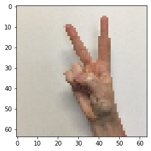

# Residual Networks

Welcome to the first assignment of this week! You'll be building a very deep convolutional network, using Residual Networks (ResNets). In theory, very deep networks can represent very complex functions; but in practice, they are hard to train. Residual Networks, introduced by [He et al.](https://arxiv.org/pdf/1512.03385.pdf), allow you to train much deeper networks than were previously feasible.

**By the end of this assignment, you'll be able to:**

- Implement the basic building blocks of ResNets in a deep neural network using Keras
- Put together these building blocks to implement and train a state-of-the-art neural network for image classification
- Implement a skip connection in your network

For this assignment, you'll use Keras. 

Before jumping into the problem, run the cell below to load the required packages.

## Table of Content

- [1 - Packages](#1)
- [2 - The Problem of Very Deep Neural Networks](#2)
- [3 - Building a Residual Network](#3)
    - [3.1 - The Identity Block](#3-1)
        - [Exercise 1 - identity_block](#ex-1)
    - [3.2 - The Convolutional Block](#3-2)
        - [Exercise 2 - convolutional_block](#ex-2)
- [4 - Building Your First ResNet Model (50 layers)](#4)
    - [Exercise 3 - ResNet50](#ex-3)
- [5 - Test on Your Own Image (Optional/Ungraded)](#5)
- [6 - Bibliography](#6)

<a name='1'></a>
## 1 - Packages


```python
import tensorflow as tf
import numpy as np
import scipy.misc
from tensorflow.keras.applications.resnet_v2 import ResNet50V2
from tensorflow.keras.preprocessing import image
from tensorflow.keras.applications.resnet_v2 import preprocess_input, decode_predictions
from tensorflow.keras import layers
from tensorflow.keras.layers import Input, Add, Dense, Activation, ZeroPadding2D, BatchNormalization, Flatten, Conv2D, AveragePooling2D, MaxPooling2D, GlobalMaxPooling2D
from tensorflow.keras.models import Model, load_model
from resnets_utils import *
from tensorflow.keras.initializers import random_uniform, glorot_uniform, constant, identity
from tensorflow.python.framework.ops import EagerTensor
from matplotlib.pyplot import imshow

from test_utils import summary, comparator
import public_tests

%matplotlib inline
```

<a name='2'></a>
## 2 - The Problem of Very Deep Neural Networks

Last week, you built your first convolutional neural networks: first manually with numpy, then using Tensorflow and Keras. 

In recent years, neural networks have become much deeper, with state-of-the-art networks evolving from having just a few layers (e.g., AlexNet) to over a hundred layers.

* The main benefit of a very deep network is that it can represent very complex functions. It can also learn features at many different levels of abstraction, from edges (at the shallower layers, closer to the input) to very complex features (at the deeper layers, closer to the output). 

* However, using a deeper network doesn't always help. A huge barrier to training them is vanishing gradients: very deep networks often have a gradient signal that goes to zero quickly, thus making gradient descent prohibitively slow.

* More specifically, during gradient descent, as you backpropagate from the final layer back to the first layer, you are multiplying by the weight matrix on each step, and thus the gradient can decrease exponentially quickly to zero (or, in rare cases, grow exponentially quickly and "explode," from gaining very large values). 

* During training, you might therefore see the magnitude (or norm) of the gradient for the shallower layers decrease to zero very rapidly as training proceeds, as shown below: 


<caption><center> <u> <font color='purple'> <b>Figure 1</b> </u><font color='purple'>  : <b>Vanishing gradient</b> <br> The speed of learning decreases very rapidly for the shallower layers as the network trains </center></caption>

Not to worry! You are now going to solve this problem by building a Residual Network!

<a name='3'></a>
## 3 - Building a Residual Network

In ResNets, a "shortcut" or a "skip connection" allows the model to skip layers:  


<caption><center> <u> <font color='purple'> <b>Figure 2</b> </u><font color='purple'>  : A ResNet block showing a skip-connection <br> </center></caption>

The image on the left shows the "main path" through the network. The image on the right adds a shortcut to the main path. By stacking these ResNet blocks on top of each other, you can form a very deep network. 

The lecture mentioned that having ResNet blocks with the shortcut also makes it very easy for one of the blocks to learn an identity function. This means that you can stack on additional ResNet blocks with little risk of harming training set performance.  
    
On that note, there is also some evidence that the ease of learning an identity function accounts for ResNets' remarkable performance even more than skip connections help with vanishing gradients.

Two main types of blocks are used in a ResNet, depending mainly on whether the input/output dimensions are the same or different. You are going to implement both of them: the "identity block" and the "convolutional block."

<a name='3-1'></a>
### 3.1 - The Identity Block

The identity block is the standard block used in ResNets, and corresponds to the case where the input activation (say $a^{[l]}$) has the same dimension as the output activation (say $a^{[l+2]}$). To flesh out the different steps of what happens in a ResNet's identity block, here is an alternative diagram showing the individual steps:


<caption><center> <u> <font color='purple'> <b>Figure 3</b> </u><font color='purple'>  : <b>Identity block.</b> Skip connection "skips over" 2 layers. </center></caption>

The upper path is the "shortcut path." The lower path is the "main path." In this diagram, notice the CONV2D and ReLU steps in each layer. To speed up training, a BatchNorm step has been added. Don't worry about this being complicated to implement--you'll see that BatchNorm is just one line of code in Keras! 

In this exercise, you'll actually implement a slightly more powerful version of this identity block, in which the skip connection "skips over" 3 hidden layers rather than 2 layers. It looks like this: 


    <caption><center> <u> <font color='purple'> <b>Figure 4</b> </u><font color='purple'>  : <b>Identity block.</b> Skip connection "skips over" 3 layers.</center></caption>

These are the individual steps:

First component of main path: 
- The first CONV2D has $F_1$ filters of shape (1,1) and a stride of (1,1). Its padding is "valid". Use 0 as the seed for the random uniform initialization: `kernel_initializer = initializer(seed=0)`. 
- The first BatchNorm is normalizing the 'channels' axis.
- Then apply the ReLU activation function. This has no hyperparameters. 

Second component of main path:
- The second CONV2D has $F_2$ filters of shape $(f,f)$ and a stride of (1,1). Its padding is "same". Use 0 as the seed for the random uniform initialization: `kernel_initializer = initializer(seed=0)`.
- The second BatchNorm is normalizing the 'channels' axis.
- Then apply the ReLU activation function. This has no hyperparameters.

Third component of main path:
- The third CONV2D has $F_3$ filters of shape (1,1) and a stride of (1,1). Its padding is "valid". Use 0 as the seed for the random uniform initialization: `kernel_initializer = initializer(seed=0)`. 
- The third BatchNorm is normalizing the 'channels' axis.
- Note that there is **no** ReLU activation function in this component. 

Final step: 
- The `X_shortcut` and the output from the 3rd layer `X` are added together.
- **Hint**: The syntax will look something like `Add()([var1,var2])`
- Then apply the ReLU activation function. This has no hyperparameters. 

<a name='ex-1'></a>
### Exercise 1 - identity_block

Implement the ResNet identity block. The first component of the main path has been implemented for you already! First, you should read these docs carefully to make sure you understand what's happening. Then, implement the rest. 
- To implement the Conv2D step: [Conv2D](https://www.tensorflow.org/api_docs/python/tf/keras/layers/Conv2D)
- To implement BatchNorm: [BatchNormalization](https://www.tensorflow.org/api_docs/python/tf/keras/layers/BatchNormalization) `BatchNormalization(axis = 3)(X, training = training)`. If training is set to False, its weights are not updated with the new examples. I.e when the model is used in prediction mode.
- For the activation, use:  `Activation('relu')(X)`
- To add the value passed forward by the shortcut: [Add](https://www.tensorflow.org/api_docs/python/tf/keras/layers/Add)

We have added the initializer argument to our functions. This parameter receives an initializer function like the ones included in the package [tensorflow.keras.initializers](https://www.tensorflow.org/api_docs/python/tf/keras/initializers) or any other custom initializer. By default it will be set to [random_uniform](https://www.tensorflow.org/api_docs/python/tf/keras/initializers/RandomUniform)

Remember that these functions accept a `seed` argument that can be any value you want, but that in this notebook must set to 0 for **grading purposes**.

 Here is where you're actually using the power of the Functional API to create a shortcut path: 


```python
# UNQ_C1
# GRADED FUNCTION: identity_block

def identity_block(X, f, filters, training=True, initializer=random_uniform):
    """
    Implementation of the identity block as defined in Figure 4
    
    Arguments:
    X -- input tensor of shape (m, n_H_prev, n_W_prev, n_C_prev)
    f -- integer, specifying the shape of the middle CONV's window for the main path
    filters -- python list of integers, defining the number of filters in the CONV layers of the main path
    training -- True: Behave in training mode
                False: Behave in inference mode
    initializer -- to set up the initial weights of a layer. Equals to random uniform initializer
    
    Returns:
    X -- output of the identity block, tensor of shape (m, n_H, n_W, n_C)
    """
    
    # Retrieve Filters
    F1, F2, F3 = filters
    
    # Save the input value. You'll need this later to add back to the main path. 
    X_shortcut = X
    
    # First component of main path
    X = Conv2D(filters = F1, kernel_size = 1, strides = (1,1), padding = 'valid', kernel_initializer = initializer(seed=0))(X)
    X = BatchNormalization(axis = 3)(X, training = training) # Default axis
    X = Activation('relu')(X)
    
    ### START CODE HERE
    ## Second component of main path (≈3 lines)
    X = Conv2D(filters = F2, kernel_size = f, strides = (1,1), padding = 'same', kernel_initializer = initializer(seed=0))(X)
    X = BatchNormalization(axis = 3)(X, training = training) # Default axis
    X = Activation('relu')(X) 

    ## Third component of main path (≈2 lines)
    X = Conv2D(filters = F3, kernel_size = 1, strides = (1,1), padding = 'valid', kernel_initializer = initializer(seed=0))(X)
    X = BatchNormalization(axis = 3)(X, training = training) # Default axis
    
    ## Final step: Add shortcut value to main path, and pass it through a RELU activation (≈2 lines)
    X = Add()([X_shortcut, X])
    X = Activation('relu')(X)  
    ### END CODE HERE

    return X
```


```python
np.random.seed(1)
X1 = np.ones((1, 4, 4, 3)) * -1
X2 = np.ones((1, 4, 4, 3)) * 1
X3 = np.ones((1, 4, 4, 3)) * 3

X = np.concatenate((X1, X2, X3), axis = 0).astype(np.float32)

A3 = identity_block(X, f=2, filters=[4, 4, 3],
                   initializer=lambda seed=0:constant(value=1),
                   training=False)
print('\033[1mWith training=False\033[0m\n')
A3np = A3.numpy()
print(np.around(A3.numpy()[:,(0,-1),:,:].mean(axis = 3), 5))
resume = A3np[:,(0,-1),:,:].mean(axis = 3)
print(resume[1, 1, 0])

print('\n\033[1mWith training=True\033[0m\n')
np.random.seed(1)
A4 = identity_block(X, f=2, filters=[3, 3, 3],
                   initializer=lambda seed=0:constant(value=1),
                   training=True)
print(np.around(A4.numpy()[:,(0,-1),:,:].mean(axis = 3), 5))

public_tests.identity_block_test(identity_block)
```

    With training=False
    
    [[[  0.        0.        0.        0.     ]
      [  0.        0.        0.        0.     ]]
    
     [[192.71234 192.71234 192.71234  96.85617]
      [ 96.85617  96.85617  96.85617  48.92808]]
    
     [[578.1371  578.1371  578.1371  290.5685 ]
      [290.5685  290.5685  290.5685  146.78426]]]
    96.85617
    
    With training=True
    
    [[[0.      0.      0.      0.     ]
      [0.      0.      0.      0.     ]]
    
     [[0.40739 0.40739 0.40739 0.40739]
      [0.40739 0.40739 0.40739 0.40739]]
    
     [[4.99991 4.99991 4.99991 3.25948]
      [3.25948 3.25948 3.25948 2.40739]]]
    All tests passed!


**Expected value**

```
With training=False

[[[  0.        0.        0.        0.     ]
  [  0.        0.        0.        0.     ]]

 [[192.71234 192.71234 192.71234  96.85617]
  [ 96.85617  96.85617  96.85617  48.92808]]

 [[578.1371  578.1371  578.1371  290.5685 ]
  [290.5685  290.5685  290.5685  146.78426]]]
96.85617

With training=True

[[[0.      0.      0.      0.     ]
  [0.      0.      0.      0.     ]]

 [[0.40739 0.40739 0.40739 0.40739]
  [0.40739 0.40739 0.40739 0.40739]]

 [[4.99991 4.99991 4.99991 3.25948]
  [3.25948 3.25948 3.25948 2.40739]]]
```

<a name='3-2'></a>
### 3.2 - The Convolutional Block

The ResNet "convolutional block" is the second block type. You can use this type of block when the input and output dimensions don't match up. The difference with the identity block is that there is a CONV2D layer in the shortcut path: 


<caption><center> <u> <font color='purple'> <b>Figure 4</b> </u><font color='purple'>  : <b>Convolutional block</b> </center></caption>

* The CONV2D layer in the shortcut path is used to resize the input $x$ to a different dimension, so that the dimensions match up in the final addition needed to add the shortcut value back to the main path. (This plays a similar role as the matrix $W_s$ discussed in lecture.) 
* For example, to reduce the activation dimensions's height and width by a factor of 2, you can use a 1x1 convolution with a stride of 2. 
* The CONV2D layer on the shortcut path does not use any non-linear activation function. Its main role is to just apply a (learned) linear function that reduces the dimension of the input, so that the dimensions match up for the later addition step. 
* As for the previous exercise, the additional `initializer` argument is required for grading purposes, and it has been set by default to [glorot_uniform](https://www.tensorflow.org/api_docs/python/tf/keras/initializers/GlorotUniform)

The details of the convolutional block are as follows. 

First component of main path:
- The first CONV2D has $F_1$ filters of shape (1,1) and a stride of (s,s). Its padding is "valid". Use 0 as the `glorot_uniform` seed `kernel_initializer = initializer(seed=0)`.
- The first BatchNorm is normalizing the 'channels' axis.
- Then apply the ReLU activation function. This has no hyperparameters. 

Second component of main path:
- The second CONV2D has $F_2$ filters of shape (f,f) and a stride of (1,1). Its padding is "same".  Use 0 as the `glorot_uniform` seed `kernel_initializer = initializer(seed=0)`.
- The second BatchNorm is normalizing the 'channels' axis.
- Then apply the ReLU activation function. This has no hyperparameters. 

Third component of main path:
- The third CONV2D has $F_3$ filters of shape (1,1) and a stride of (1,1). Its padding is "valid".  Use 0 as the `glorot_uniform` seed `kernel_initializer = initializer(seed=0)`.
- The third BatchNorm is normalizing the 'channels' axis. Note that there is no ReLU activation function in this component. 

Shortcut path:
- The CONV2D has $F_3$ filters of shape (1,1) and a stride of (s,s). Its padding is "valid".  Use 0 as the `glorot_uniform` seed `kernel_initializer = initializer(seed=0)`.
- The BatchNorm is normalizing the 'channels' axis. 

Final step: 
- The shortcut and the main path values are added together.
- Then apply the ReLU activation function. This has no hyperparameters. 
 
<a name='ex-2'></a>    
### Exercise 2 - convolutional_block
    
Implement the convolutional block. The first component of the main path is already implemented; then it's your turn to implement the rest! As before, always use 0 as the seed for the random initialization, to ensure consistency with the grader.
- [Conv2D](https://www.tensorflow.org/api_docs/python/tf/keras/layers/Conv2D)
- [BatchNormalization](https://www.tensorflow.org/api_docs/python/tf/keras/layers/BatchNormalization) (axis: Integer, the axis that should be normalized (typically the features axis)) `BatchNormalization(axis = 3)(X, training = training)`. If training is set to False, its weights are not updated with the new examples. I.e when the model is used in prediction mode.
- For the activation, use:  `Activation('relu')(X)`
- [Add](https://www.tensorflow.org/api_docs/python/tf/keras/layers/Add)
    
We have added the initializer argument to our functions. This parameter receives an initializer function like the ones included in the package [tensorflow.keras.initializers](https://www.tensorflow.org/api_docs/python/tf/keras/initializers) or any other custom initializer. By default it will be set to [random_uniform](https://www.tensorflow.org/api_docs/python/tf/keras/initializers/RandomUniform)

Remember that these functions accept a `seed` argument that can be any value you want, but that in this notebook must set to 0 for **grading purposes**.


```python
# UNQ_C2
# GRADED FUNCTION: convolutional_block

def convolutional_block(X, f, filters, s = 2, training=True, initializer=glorot_uniform):
    """
    Implementation of the convolutional block as defined in Figure 4
    
    Arguments:
    X -- input tensor of shape (m, n_H_prev, n_W_prev, n_C_prev)
    f -- integer, specifying the shape of the middle CONV's window for the main path
    filters -- python list of integers, defining the number of filters in the CONV layers of the main path
    s -- Integer, specifying the stride to be used
    training -- True: Behave in training mode
                False: Behave in inference mode
    initializer -- to set up the initial weights of a layer. Equals to Glorot uniform initializer, 
                   also called Xavier uniform initializer.
    
    Returns:
    X -- output of the convolutional block, tensor of shape (n_H, n_W, n_C)
    """
    
    # Retrieve Filters
    F1, F2, F3 = filters
    
    # Save the input value
    X_shortcut = X


    ##### MAIN PATH #####
    
    # First component of main path glorot_uniform(seed=0)
    X = Conv2D(filters = F1, kernel_size = 1, strides = (s, s), padding='valid', kernel_initializer = initializer(seed=0))(X)
    X = BatchNormalization(axis = 3)(X, training=training)
    X = Activation('relu')(X)

    ### START CODE HERE
    
    ## Second component of main path (≈3 lines)
    X = Conv2D(filters = F2, kernel_size = f, strides = (1,1), padding = 'same', kernel_initializer = initializer(seed=0))(X)
    X = BatchNormalization(axis = 3)(X, training=training)
    X = Activation('relu')(X)

    ## Third component of main path (≈2 lines)
    X = Conv2D(filters = F3, kernel_size = 1, strides = (1, 1), padding='valid', kernel_initializer = initializer(seed=0))(X)
    X = BatchNormalization(axis = 3)(X, training=training)
    
    ##### SHORTCUT PATH ##### (≈2 lines)
    X_shortcut = Conv2D(filters = F3, kernel_size = 1, strides = (s, s), padding='valid', kernel_initializer = initializer(seed=0))(X_shortcut)
    X_shortcut = BatchNormalization(axis = 3)(X_shortcut, training=training)
    
    ### END CODE HERE

    # Final step: Add shortcut value to main path (Use this order [X, X_shortcut]), and pass it through a RELU activation
    X = Add()([X, X_shortcut])
    X = Activation('relu')(X)
    
    return X
```


```python
from outputs import convolutional_block_output1, convolutional_block_output2
np.random.seed(1)
#X = np.random.randn(3, 4, 4, 6).astype(np.float32)
X1 = np.ones((1, 4, 4, 3)) * -1
X2 = np.ones((1, 4, 4, 3)) * 1
X3 = np.ones((1, 4, 4, 3)) * 3

X = np.concatenate((X1, X2, X3), axis = 0).astype(np.float32)

A = convolutional_block(X, f = 2, filters = [2, 4, 6], training=False)

assert type(A) == EagerTensor, "Use only tensorflow and keras functions"
assert tuple(tf.shape(A).numpy()) == (3, 2, 2, 6), "Wrong shape."
assert np.allclose(A.numpy(), convolutional_block_output1), "Wrong values when training=False."
print(A[0])

B = convolutional_block(X, f = 2, filters = [2, 4, 6], training=True)
assert np.allclose(B.numpy(), convolutional_block_output2), "Wrong values when training=True."

print('\033[92mAll tests passed!')

```

    tf.Tensor(
    [[[0.         0.66683817 0.         0.         0.88853896 0.5274254 ]
      [0.         0.65053666 0.         0.         0.89592844 0.49965227]]
    
     [[0.         0.6312079  0.         0.         0.8636247  0.47643146]
      [0.         0.5688321  0.         0.         0.85534114 0.41709304]]], shape=(2, 2, 6), dtype=float32)
    All tests passed!


**Expected value**

```
tf.Tensor(
[[[0.         0.66683817 0.         0.         0.88853896 0.5274254 ]
  [0.         0.65053666 0.         0.         0.89592844 0.49965227]]

 [[0.         0.6312079  0.         0.         0.8636247  0.47643146]
  [0.         0.5688321  0.         0.         0.85534114 0.41709304]]], shape=(2, 2, 6), dtype=float32)
```

<a name='4'></a>  
## 4 - Building Your First ResNet Model (50 layers)

You now have the necessary blocks to build a very deep ResNet. The following figure describes in detail the architecture of this neural network. "ID BLOCK" in the diagram stands for "Identity block," and "ID BLOCK x3" means you should stack 3 identity blocks together.


<caption><center> <u> <font color='purple'> <b>Figure 5</b> </u><font color='purple'>  : <b>ResNet-50 model</b> </center></caption>

The details of this ResNet-50 model are:
- Zero-padding pads the input with a pad of (3,3)
- Stage 1:
    - The 2D Convolution has 64 filters of shape (7,7) and uses a stride of (2,2). 
    - BatchNorm is applied to the 'channels' axis of the input.
    - ReLU activation is applied.
    - MaxPooling uses a (3,3) window and a (2,2) stride.
- Stage 2:
    - The convolutional block uses three sets of filters of size [64,64,256], "f" is 3, and "s" is 1.
    - The 2 identity blocks use three sets of filters of size [64,64,256], and "f" is 3.
- Stage 3:
    - The convolutional block uses three sets of filters of size [128,128,512], "f" is 3 and "s" is 2.
    - The 3 identity blocks use three sets of filters of size [128,128,512] and "f" is 3.
- Stage 4:
    - The convolutional block uses three sets of filters of size [256, 256, 1024], "f" is 3 and "s" is 2.
    - The 5 identity blocks use three sets of filters of size [256, 256, 1024] and "f" is 3.
- Stage 5:
    - The convolutional block uses three sets of filters of size [512, 512, 2048], "f" is 3 and "s" is 2.
    - The 2 identity blocks use three sets of filters of size [512, 512, 2048] and "f" is 3.
- The 2D Average Pooling uses a window of shape (2,2).
- The 'flatten' layer doesn't have any hyperparameters.
- The Fully Connected (Dense) layer reduces its input to the number of classes using a softmax activation.

    
<a name='ex-3'></a>      
### Exercise 3 - ResNet50 
    
Implement the ResNet with 50 layers described in the figure above. We have implemented Stages 1 and 2. Please implement the rest. (The syntax for implementing Stages 3-5 should be quite similar to that of Stage 2) Make sure you follow the naming convention in the text above. 

You'll need to use this function: 
- Average pooling [see reference](https://www.tensorflow.org/api_docs/python/tf/keras/layers/AveragePooling2D)

Here are some other functions we used in the code below:
- Conv2D: [See reference](https://www.tensorflow.org/api_docs/python/tf/keras/layers/Conv2D)
- BatchNorm: [See reference](https://www.tensorflow.org/api_docs/python/tf/keras/layers/BatchNormalization) (axis: Integer, the axis that should be normalized (typically the features axis))
- Zero padding: [See reference](https://www.tensorflow.org/api_docs/python/tf/keras/layers/ZeroPadding2D)
- Max pooling: [See reference](https://www.tensorflow.org/api_docs/python/tf/keras/layers/MaxPool2D)
- Fully connected layer: [See reference](https://www.tensorflow.org/api_docs/python/tf/keras/layers/Dense)
- Addition: [See reference](https://www.tensorflow.org/api_docs/python/tf/keras/layers/Add)


```python
# UNQ_C3
# GRADED FUNCTION: ResNet50

def ResNet50(input_shape = (64, 64, 3), classes = 6):
    """
    Stage-wise implementation of the architecture of the popular ResNet50:
    CONV2D -> BATCHNORM -> RELU -> MAXPOOL -> CONVBLOCK -> IDBLOCK*2 -> CONVBLOCK -> IDBLOCK*3
    -> CONVBLOCK -> IDBLOCK*5 -> CONVBLOCK -> IDBLOCK*2 -> AVGPOOL -> FLATTEN -> DENSE 

    Arguments:
    input_shape -- shape of the images of the dataset
    classes -- integer, number of classes

    Returns:
    model -- a Model() instance in Keras
    """
    
    # Define the input as a tensor with shape input_shape
    X_input = Input(input_shape)

    
    # Zero-Padding
    X = ZeroPadding2D((3, 3))(X_input)
    
    # Stage 1
    X = Conv2D(64, (7, 7), strides = (2, 2), kernel_initializer = glorot_uniform(seed=0))(X)
    X = BatchNormalization(axis = 3)(X)
    X = Activation('relu')(X)
    X = MaxPooling2D((3, 3), strides=(2, 2))(X)

    # Stage 2
    X = convolutional_block(X, f = 3, filters = [64, 64, 256], s = 1)
    X = identity_block(X, 3, [64, 64, 256])
    X = identity_block(X, 3, [64, 64, 256])

    ### START CODE HERE
    
    ## Stage 3 (≈4 lines)
    X = convolutional_block(X, f = 3, filters = [128,128,512], s = 2)
    X = identity_block(X, 3, [128,128,512])
    X = identity_block(X, 3, [128,128,512])
    X = identity_block(X, 3, [128,128,512])

    ## Stage 4 (≈6 lines)
    X = convolutional_block(X, f = 3, filters = [256,256,1024], s = 2)
    X = identity_block(X, 3, [256,256,1024])
    X = identity_block(X, 3, [256,256,1024])
    X = identity_block(X, 3, [256,256,1024])
    X = identity_block(X, 3, [256,256,1024])
    X = identity_block(X, 3, [256,256,1024])


    ## Stage 5 (≈3 lines)
    X = convolutional_block(X, f = 3, filters = [512,512,2048], s = 2)
    X = identity_block(X, 3, [512,512,2048])
    X = identity_block(X, 3, [512,512,2048])

    ## AVGPOOL (≈1 line). Use "X = AveragePooling2D(...)(X)"
    X = AveragePooling2D(pool_size=(2, 2))(X)
    
    ### END CODE HERE

    # output layer
    X = Flatten()(X)
    X = Dense(classes, activation='softmax', kernel_initializer = glorot_uniform(seed=0))(X)
    
    
    # Create model
    model = Model(inputs = X_input, outputs = X)

    return model
```

Run the following code to build the model's graph. If your implementation is incorrect, you'll know it by checking your accuracy when running `model.fit(...)` below.


```python
model = ResNet50(input_shape = (64, 64, 3), classes = 6)
print(model.summary())
```

    Model: "functional_1"
    __________________________________________________________________________________________________
    Layer (type)                    Output Shape         Param #     Connected to                     
    ==================================================================================================
    input_3 (InputLayer)            [(None, 64, 64, 3)]  0                                            
    __________________________________________________________________________________________________
    zero_padding2d_2 (ZeroPadding2D (None, 70, 70, 3)    0           input_3[0][0]                    
    __________________________________________________________________________________________________
    conv2d_132 (Conv2D)             (None, 32, 32, 64)   9472        zero_padding2d_2[0][0]           
    __________________________________________________________________________________________________
    batch_normalization_132 (BatchN (None, 32, 32, 64)   256         conv2d_132[0][0]                 
    __________________________________________________________________________________________________
    activation_120 (Activation)     (None, 32, 32, 64)   0           batch_normalization_132[0][0]    
    __________________________________________________________________________________________________
    max_pooling2d_2 (MaxPooling2D)  (None, 15, 15, 64)   0           activation_120[0][0]             
    __________________________________________________________________________________________________
    conv2d_133 (Conv2D)             (None, 15, 15, 64)   4160        max_pooling2d_2[0][0]            
    __________________________________________________________________________________________________
    batch_normalization_133 (BatchN (None, 15, 15, 64)   256         conv2d_133[0][0]                 
    __________________________________________________________________________________________________
    activation_121 (Activation)     (None, 15, 15, 64)   0           batch_normalization_133[0][0]    
    __________________________________________________________________________________________________
    conv2d_134 (Conv2D)             (None, 15, 15, 64)   36928       activation_121[0][0]             
    __________________________________________________________________________________________________
    batch_normalization_134 (BatchN (None, 15, 15, 64)   256         conv2d_134[0][0]                 
    __________________________________________________________________________________________________
    activation_122 (Activation)     (None, 15, 15, 64)   0           batch_normalization_134[0][0]    
    __________________________________________________________________________________________________
    conv2d_135 (Conv2D)             (None, 15, 15, 256)  16640       activation_122[0][0]             
    __________________________________________________________________________________________________
    conv2d_136 (Conv2D)             (None, 15, 15, 256)  16640       max_pooling2d_2[0][0]            
    __________________________________________________________________________________________________
    batch_normalization_135 (BatchN (None, 15, 15, 256)  1024        conv2d_135[0][0]                 
    __________________________________________________________________________________________________
    batch_normalization_136 (BatchN (None, 15, 15, 256)  1024        conv2d_136[0][0]                 
    __________________________________________________________________________________________________
    add_38 (Add)                    (None, 15, 15, 256)  0           batch_normalization_135[0][0]    
                                                                     batch_normalization_136[0][0]    
    __________________________________________________________________________________________________
    activation_123 (Activation)     (None, 15, 15, 256)  0           add_38[0][0]                     
    __________________________________________________________________________________________________
    conv2d_137 (Conv2D)             (None, 15, 15, 64)   16448       activation_123[0][0]             
    __________________________________________________________________________________________________
    batch_normalization_137 (BatchN (None, 15, 15, 64)   256         conv2d_137[0][0]                 
    __________________________________________________________________________________________________
    activation_124 (Activation)     (None, 15, 15, 64)   0           batch_normalization_137[0][0]    
    __________________________________________________________________________________________________
    conv2d_138 (Conv2D)             (None, 15, 15, 64)   36928       activation_124[0][0]             
    __________________________________________________________________________________________________
    batch_normalization_138 (BatchN (None, 15, 15, 64)   256         conv2d_138[0][0]                 
    __________________________________________________________________________________________________
    activation_125 (Activation)     (None, 15, 15, 64)   0           batch_normalization_138[0][0]    
    __________________________________________________________________________________________________
    conv2d_139 (Conv2D)             (None, 15, 15, 256)  16640       activation_125[0][0]             
    __________________________________________________________________________________________________
    batch_normalization_139 (BatchN (None, 15, 15, 256)  1024        conv2d_139[0][0]                 
    __________________________________________________________________________________________________
    add_39 (Add)                    (None, 15, 15, 256)  0           activation_123[0][0]             
                                                                     batch_normalization_139[0][0]    
    __________________________________________________________________________________________________
    activation_126 (Activation)     (None, 15, 15, 256)  0           add_39[0][0]                     
    __________________________________________________________________________________________________
    conv2d_140 (Conv2D)             (None, 15, 15, 64)   16448       activation_126[0][0]             
    __________________________________________________________________________________________________
    batch_normalization_140 (BatchN (None, 15, 15, 64)   256         conv2d_140[0][0]                 
    __________________________________________________________________________________________________
    activation_127 (Activation)     (None, 15, 15, 64)   0           batch_normalization_140[0][0]    
    __________________________________________________________________________________________________
    conv2d_141 (Conv2D)             (None, 15, 15, 64)   36928       activation_127[0][0]             
    __________________________________________________________________________________________________
    batch_normalization_141 (BatchN (None, 15, 15, 64)   256         conv2d_141[0][0]                 
    __________________________________________________________________________________________________
    activation_128 (Activation)     (None, 15, 15, 64)   0           batch_normalization_141[0][0]    
    __________________________________________________________________________________________________
    conv2d_142 (Conv2D)             (None, 15, 15, 256)  16640       activation_128[0][0]             
    __________________________________________________________________________________________________
    batch_normalization_142 (BatchN (None, 15, 15, 256)  1024        conv2d_142[0][0]                 
    __________________________________________________________________________________________________
    add_40 (Add)                    (None, 15, 15, 256)  0           activation_126[0][0]             
                                                                     batch_normalization_142[0][0]    
    __________________________________________________________________________________________________
    activation_129 (Activation)     (None, 15, 15, 256)  0           add_40[0][0]                     
    __________________________________________________________________________________________________
    conv2d_143 (Conv2D)             (None, 8, 8, 128)    32896       activation_129[0][0]             
    __________________________________________________________________________________________________
    batch_normalization_143 (BatchN (None, 8, 8, 128)    512         conv2d_143[0][0]                 
    __________________________________________________________________________________________________
    activation_130 (Activation)     (None, 8, 8, 128)    0           batch_normalization_143[0][0]    
    __________________________________________________________________________________________________
    conv2d_144 (Conv2D)             (None, 8, 8, 128)    147584      activation_130[0][0]             
    __________________________________________________________________________________________________
    batch_normalization_144 (BatchN (None, 8, 8, 128)    512         conv2d_144[0][0]                 
    __________________________________________________________________________________________________
    activation_131 (Activation)     (None, 8, 8, 128)    0           batch_normalization_144[0][0]    
    __________________________________________________________________________________________________
    conv2d_145 (Conv2D)             (None, 8, 8, 512)    66048       activation_131[0][0]             
    __________________________________________________________________________________________________
    conv2d_146 (Conv2D)             (None, 8, 8, 512)    131584      activation_129[0][0]             
    __________________________________________________________________________________________________
    batch_normalization_145 (BatchN (None, 8, 8, 512)    2048        conv2d_145[0][0]                 
    __________________________________________________________________________________________________
    batch_normalization_146 (BatchN (None, 8, 8, 512)    2048        conv2d_146[0][0]                 
    __________________________________________________________________________________________________
    add_41 (Add)                    (None, 8, 8, 512)    0           batch_normalization_145[0][0]    
                                                                     batch_normalization_146[0][0]    
    __________________________________________________________________________________________________
    activation_132 (Activation)     (None, 8, 8, 512)    0           add_41[0][0]                     
    __________________________________________________________________________________________________
    conv2d_147 (Conv2D)             (None, 8, 8, 128)    65664       activation_132[0][0]             
    __________________________________________________________________________________________________
    batch_normalization_147 (BatchN (None, 8, 8, 128)    512         conv2d_147[0][0]                 
    __________________________________________________________________________________________________
    activation_133 (Activation)     (None, 8, 8, 128)    0           batch_normalization_147[0][0]    
    __________________________________________________________________________________________________
    conv2d_148 (Conv2D)             (None, 8, 8, 128)    147584      activation_133[0][0]             
    __________________________________________________________________________________________________
    batch_normalization_148 (BatchN (None, 8, 8, 128)    512         conv2d_148[0][0]                 
    __________________________________________________________________________________________________
    activation_134 (Activation)     (None, 8, 8, 128)    0           batch_normalization_148[0][0]    
    __________________________________________________________________________________________________
    conv2d_149 (Conv2D)             (None, 8, 8, 512)    66048       activation_134[0][0]             
    __________________________________________________________________________________________________
    batch_normalization_149 (BatchN (None, 8, 8, 512)    2048        conv2d_149[0][0]                 
    __________________________________________________________________________________________________
    add_42 (Add)                    (None, 8, 8, 512)    0           activation_132[0][0]             
                                                                     batch_normalization_149[0][0]    
    __________________________________________________________________________________________________
    activation_135 (Activation)     (None, 8, 8, 512)    0           add_42[0][0]                     
    __________________________________________________________________________________________________
    conv2d_150 (Conv2D)             (None, 8, 8, 128)    65664       activation_135[0][0]             
    __________________________________________________________________________________________________
    batch_normalization_150 (BatchN (None, 8, 8, 128)    512         conv2d_150[0][0]                 
    __________________________________________________________________________________________________
    activation_136 (Activation)     (None, 8, 8, 128)    0           batch_normalization_150[0][0]    
    __________________________________________________________________________________________________
    conv2d_151 (Conv2D)             (None, 8, 8, 128)    147584      activation_136[0][0]             
    __________________________________________________________________________________________________
    batch_normalization_151 (BatchN (None, 8, 8, 128)    512         conv2d_151[0][0]                 
    __________________________________________________________________________________________________
    activation_137 (Activation)     (None, 8, 8, 128)    0           batch_normalization_151[0][0]    
    __________________________________________________________________________________________________
    conv2d_152 (Conv2D)             (None, 8, 8, 512)    66048       activation_137[0][0]             
    __________________________________________________________________________________________________
    batch_normalization_152 (BatchN (None, 8, 8, 512)    2048        conv2d_152[0][0]                 
    __________________________________________________________________________________________________
    add_43 (Add)                    (None, 8, 8, 512)    0           activation_135[0][0]             
                                                                     batch_normalization_152[0][0]    
    __________________________________________________________________________________________________
    activation_138 (Activation)     (None, 8, 8, 512)    0           add_43[0][0]                     
    __________________________________________________________________________________________________
    conv2d_153 (Conv2D)             (None, 8, 8, 128)    65664       activation_138[0][0]             
    __________________________________________________________________________________________________
    batch_normalization_153 (BatchN (None, 8, 8, 128)    512         conv2d_153[0][0]                 
    __________________________________________________________________________________________________
    activation_139 (Activation)     (None, 8, 8, 128)    0           batch_normalization_153[0][0]    
    __________________________________________________________________________________________________
    conv2d_154 (Conv2D)             (None, 8, 8, 128)    147584      activation_139[0][0]             
    __________________________________________________________________________________________________
    batch_normalization_154 (BatchN (None, 8, 8, 128)    512         conv2d_154[0][0]                 
    __________________________________________________________________________________________________
    activation_140 (Activation)     (None, 8, 8, 128)    0           batch_normalization_154[0][0]    
    __________________________________________________________________________________________________
    conv2d_155 (Conv2D)             (None, 8, 8, 512)    66048       activation_140[0][0]             
    __________________________________________________________________________________________________
    batch_normalization_155 (BatchN (None, 8, 8, 512)    2048        conv2d_155[0][0]                 
    __________________________________________________________________________________________________
    add_44 (Add)                    (None, 8, 8, 512)    0           activation_138[0][0]             
                                                                     batch_normalization_155[0][0]    
    __________________________________________________________________________________________________
    activation_141 (Activation)     (None, 8, 8, 512)    0           add_44[0][0]                     
    __________________________________________________________________________________________________
    conv2d_156 (Conv2D)             (None, 4, 4, 256)    131328      activation_141[0][0]             
    __________________________________________________________________________________________________
    batch_normalization_156 (BatchN (None, 4, 4, 256)    1024        conv2d_156[0][0]                 
    __________________________________________________________________________________________________
    activation_142 (Activation)     (None, 4, 4, 256)    0           batch_normalization_156[0][0]    
    __________________________________________________________________________________________________
    conv2d_157 (Conv2D)             (None, 4, 4, 256)    590080      activation_142[0][0]             
    __________________________________________________________________________________________________
    batch_normalization_157 (BatchN (None, 4, 4, 256)    1024        conv2d_157[0][0]                 
    __________________________________________________________________________________________________
    activation_143 (Activation)     (None, 4, 4, 256)    0           batch_normalization_157[0][0]    
    __________________________________________________________________________________________________
    conv2d_158 (Conv2D)             (None, 4, 4, 1024)   263168      activation_143[0][0]             
    __________________________________________________________________________________________________
    conv2d_159 (Conv2D)             (None, 4, 4, 1024)   525312      activation_141[0][0]             
    __________________________________________________________________________________________________
    batch_normalization_158 (BatchN (None, 4, 4, 1024)   4096        conv2d_158[0][0]                 
    __________________________________________________________________________________________________
    batch_normalization_159 (BatchN (None, 4, 4, 1024)   4096        conv2d_159[0][0]                 
    __________________________________________________________________________________________________
    add_45 (Add)                    (None, 4, 4, 1024)   0           batch_normalization_158[0][0]    
                                                                     batch_normalization_159[0][0]    
    __________________________________________________________________________________________________
    activation_144 (Activation)     (None, 4, 4, 1024)   0           add_45[0][0]                     
    __________________________________________________________________________________________________
    conv2d_160 (Conv2D)             (None, 4, 4, 256)    262400      activation_144[0][0]             
    __________________________________________________________________________________________________
    batch_normalization_160 (BatchN (None, 4, 4, 256)    1024        conv2d_160[0][0]                 
    __________________________________________________________________________________________________
    activation_145 (Activation)     (None, 4, 4, 256)    0           batch_normalization_160[0][0]    
    __________________________________________________________________________________________________
    conv2d_161 (Conv2D)             (None, 4, 4, 256)    590080      activation_145[0][0]             
    __________________________________________________________________________________________________
    batch_normalization_161 (BatchN (None, 4, 4, 256)    1024        conv2d_161[0][0]                 
    __________________________________________________________________________________________________
    activation_146 (Activation)     (None, 4, 4, 256)    0           batch_normalization_161[0][0]    
    __________________________________________________________________________________________________
    conv2d_162 (Conv2D)             (None, 4, 4, 1024)   263168      activation_146[0][0]             
    __________________________________________________________________________________________________
    batch_normalization_162 (BatchN (None, 4, 4, 1024)   4096        conv2d_162[0][0]                 
    __________________________________________________________________________________________________
    add_46 (Add)                    (None, 4, 4, 1024)   0           activation_144[0][0]             
                                                                     batch_normalization_162[0][0]    
    __________________________________________________________________________________________________
    activation_147 (Activation)     (None, 4, 4, 1024)   0           add_46[0][0]                     
    __________________________________________________________________________________________________
    conv2d_163 (Conv2D)             (None, 4, 4, 256)    262400      activation_147[0][0]             
    __________________________________________________________________________________________________
    batch_normalization_163 (BatchN (None, 4, 4, 256)    1024        conv2d_163[0][0]                 
    __________________________________________________________________________________________________
    activation_148 (Activation)     (None, 4, 4, 256)    0           batch_normalization_163[0][0]    
    __________________________________________________________________________________________________
    conv2d_164 (Conv2D)             (None, 4, 4, 256)    590080      activation_148[0][0]             
    __________________________________________________________________________________________________
    batch_normalization_164 (BatchN (None, 4, 4, 256)    1024        conv2d_164[0][0]                 
    __________________________________________________________________________________________________
    activation_149 (Activation)     (None, 4, 4, 256)    0           batch_normalization_164[0][0]    
    __________________________________________________________________________________________________
    conv2d_165 (Conv2D)             (None, 4, 4, 1024)   263168      activation_149[0][0]             
    __________________________________________________________________________________________________
    batch_normalization_165 (BatchN (None, 4, 4, 1024)   4096        conv2d_165[0][0]                 
    __________________________________________________________________________________________________
    add_47 (Add)                    (None, 4, 4, 1024)   0           activation_147[0][0]             
                                                                     batch_normalization_165[0][0]    
    __________________________________________________________________________________________________
    activation_150 (Activation)     (None, 4, 4, 1024)   0           add_47[0][0]                     
    __________________________________________________________________________________________________
    conv2d_166 (Conv2D)             (None, 4, 4, 256)    262400      activation_150[0][0]             
    __________________________________________________________________________________________________
    batch_normalization_166 (BatchN (None, 4, 4, 256)    1024        conv2d_166[0][0]                 
    __________________________________________________________________________________________________
    activation_151 (Activation)     (None, 4, 4, 256)    0           batch_normalization_166[0][0]    
    __________________________________________________________________________________________________
    conv2d_167 (Conv2D)             (None, 4, 4, 256)    590080      activation_151[0][0]             
    __________________________________________________________________________________________________
    batch_normalization_167 (BatchN (None, 4, 4, 256)    1024        conv2d_167[0][0]                 
    __________________________________________________________________________________________________
    activation_152 (Activation)     (None, 4, 4, 256)    0           batch_normalization_167[0][0]    
    __________________________________________________________________________________________________
    conv2d_168 (Conv2D)             (None, 4, 4, 1024)   263168      activation_152[0][0]             
    __________________________________________________________________________________________________
    batch_normalization_168 (BatchN (None, 4, 4, 1024)   4096        conv2d_168[0][0]                 
    __________________________________________________________________________________________________
    add_48 (Add)                    (None, 4, 4, 1024)   0           activation_150[0][0]             
                                                                     batch_normalization_168[0][0]    
    __________________________________________________________________________________________________
    activation_153 (Activation)     (None, 4, 4, 1024)   0           add_48[0][0]                     
    __________________________________________________________________________________________________
    conv2d_169 (Conv2D)             (None, 4, 4, 256)    262400      activation_153[0][0]             
    __________________________________________________________________________________________________
    batch_normalization_169 (BatchN (None, 4, 4, 256)    1024        conv2d_169[0][0]                 
    __________________________________________________________________________________________________
    activation_154 (Activation)     (None, 4, 4, 256)    0           batch_normalization_169[0][0]    
    __________________________________________________________________________________________________
    conv2d_170 (Conv2D)             (None, 4, 4, 256)    590080      activation_154[0][0]             
    __________________________________________________________________________________________________
    batch_normalization_170 (BatchN (None, 4, 4, 256)    1024        conv2d_170[0][0]                 
    __________________________________________________________________________________________________
    activation_155 (Activation)     (None, 4, 4, 256)    0           batch_normalization_170[0][0]    
    __________________________________________________________________________________________________
    conv2d_171 (Conv2D)             (None, 4, 4, 1024)   263168      activation_155[0][0]             
    __________________________________________________________________________________________________
    batch_normalization_171 (BatchN (None, 4, 4, 1024)   4096        conv2d_171[0][0]                 
    __________________________________________________________________________________________________
    add_49 (Add)                    (None, 4, 4, 1024)   0           activation_153[0][0]             
                                                                     batch_normalization_171[0][0]    
    __________________________________________________________________________________________________
    activation_156 (Activation)     (None, 4, 4, 1024)   0           add_49[0][0]                     
    __________________________________________________________________________________________________
    conv2d_172 (Conv2D)             (None, 4, 4, 256)    262400      activation_156[0][0]             
    __________________________________________________________________________________________________
    batch_normalization_172 (BatchN (None, 4, 4, 256)    1024        conv2d_172[0][0]                 
    __________________________________________________________________________________________________
    activation_157 (Activation)     (None, 4, 4, 256)    0           batch_normalization_172[0][0]    
    __________________________________________________________________________________________________
    conv2d_173 (Conv2D)             (None, 4, 4, 256)    590080      activation_157[0][0]             
    __________________________________________________________________________________________________
    batch_normalization_173 (BatchN (None, 4, 4, 256)    1024        conv2d_173[0][0]                 
    __________________________________________________________________________________________________
    activation_158 (Activation)     (None, 4, 4, 256)    0           batch_normalization_173[0][0]    
    __________________________________________________________________________________________________
    conv2d_174 (Conv2D)             (None, 4, 4, 1024)   263168      activation_158[0][0]             
    __________________________________________________________________________________________________
    batch_normalization_174 (BatchN (None, 4, 4, 1024)   4096        conv2d_174[0][0]                 
    __________________________________________________________________________________________________
    add_50 (Add)                    (None, 4, 4, 1024)   0           activation_156[0][0]             
                                                                     batch_normalization_174[0][0]    
    __________________________________________________________________________________________________
    activation_159 (Activation)     (None, 4, 4, 1024)   0           add_50[0][0]                     
    __________________________________________________________________________________________________
    conv2d_175 (Conv2D)             (None, 2, 2, 512)    524800      activation_159[0][0]             
    __________________________________________________________________________________________________
    batch_normalization_175 (BatchN (None, 2, 2, 512)    2048        conv2d_175[0][0]                 
    __________________________________________________________________________________________________
    activation_160 (Activation)     (None, 2, 2, 512)    0           batch_normalization_175[0][0]    
    __________________________________________________________________________________________________
    conv2d_176 (Conv2D)             (None, 2, 2, 512)    2359808     activation_160[0][0]             
    __________________________________________________________________________________________________
    batch_normalization_176 (BatchN (None, 2, 2, 512)    2048        conv2d_176[0][0]                 
    __________________________________________________________________________________________________
    activation_161 (Activation)     (None, 2, 2, 512)    0           batch_normalization_176[0][0]    
    __________________________________________________________________________________________________
    conv2d_177 (Conv2D)             (None, 2, 2, 2048)   1050624     activation_161[0][0]             
    __________________________________________________________________________________________________
    conv2d_178 (Conv2D)             (None, 2, 2, 2048)   2099200     activation_159[0][0]             
    __________________________________________________________________________________________________
    batch_normalization_177 (BatchN (None, 2, 2, 2048)   8192        conv2d_177[0][0]                 
    __________________________________________________________________________________________________
    batch_normalization_178 (BatchN (None, 2, 2, 2048)   8192        conv2d_178[0][0]                 
    __________________________________________________________________________________________________
    add_51 (Add)                    (None, 2, 2, 2048)   0           batch_normalization_177[0][0]    
                                                                     batch_normalization_178[0][0]    
    __________________________________________________________________________________________________
    activation_162 (Activation)     (None, 2, 2, 2048)   0           add_51[0][0]                     
    __________________________________________________________________________________________________
    conv2d_179 (Conv2D)             (None, 2, 2, 512)    1049088     activation_162[0][0]             
    __________________________________________________________________________________________________
    batch_normalization_179 (BatchN (None, 2, 2, 512)    2048        conv2d_179[0][0]                 
    __________________________________________________________________________________________________
    activation_163 (Activation)     (None, 2, 2, 512)    0           batch_normalization_179[0][0]    
    __________________________________________________________________________________________________
    conv2d_180 (Conv2D)             (None, 2, 2, 512)    2359808     activation_163[0][0]             
    __________________________________________________________________________________________________
    batch_normalization_180 (BatchN (None, 2, 2, 512)    2048        conv2d_180[0][0]                 
    __________________________________________________________________________________________________
    activation_164 (Activation)     (None, 2, 2, 512)    0           batch_normalization_180[0][0]    
    __________________________________________________________________________________________________
    conv2d_181 (Conv2D)             (None, 2, 2, 2048)   1050624     activation_164[0][0]             
    __________________________________________________________________________________________________
    batch_normalization_181 (BatchN (None, 2, 2, 2048)   8192        conv2d_181[0][0]                 
    __________________________________________________________________________________________________
    add_52 (Add)                    (None, 2, 2, 2048)   0           activation_162[0][0]             
                                                                     batch_normalization_181[0][0]    
    __________________________________________________________________________________________________
    activation_165 (Activation)     (None, 2, 2, 2048)   0           add_52[0][0]                     
    __________________________________________________________________________________________________
    conv2d_182 (Conv2D)             (None, 2, 2, 512)    1049088     activation_165[0][0]             
    __________________________________________________________________________________________________
    batch_normalization_182 (BatchN (None, 2, 2, 512)    2048        conv2d_182[0][0]                 
    __________________________________________________________________________________________________
    activation_166 (Activation)     (None, 2, 2, 512)    0           batch_normalization_182[0][0]    
    __________________________________________________________________________________________________
    conv2d_183 (Conv2D)             (None, 2, 2, 512)    2359808     activation_166[0][0]             
    __________________________________________________________________________________________________
    batch_normalization_183 (BatchN (None, 2, 2, 512)    2048        conv2d_183[0][0]                 
    __________________________________________________________________________________________________
    activation_167 (Activation)     (None, 2, 2, 512)    0           batch_normalization_183[0][0]    
    __________________________________________________________________________________________________
    conv2d_184 (Conv2D)             (None, 2, 2, 2048)   1050624     activation_167[0][0]             
    __________________________________________________________________________________________________
    batch_normalization_184 (BatchN (None, 2, 2, 2048)   8192        conv2d_184[0][0]                 
    __________________________________________________________________________________________________
    add_53 (Add)                    (None, 2, 2, 2048)   0           activation_165[0][0]             
                                                                     batch_normalization_184[0][0]    
    __________________________________________________________________________________________________
    activation_168 (Activation)     (None, 2, 2, 2048)   0           add_53[0][0]                     
    __________________________________________________________________________________________________
    average_pooling2d (AveragePooli (None, 1, 1, 2048)   0           activation_168[0][0]             
    __________________________________________________________________________________________________
    flatten (Flatten)               (None, 2048)         0           average_pooling2d[0][0]          
    __________________________________________________________________________________________________
    dense (Dense)                   (None, 6)            12294       flatten[0][0]                    
    ==================================================================================================
    Total params: 23,600,006
    Trainable params: 23,546,886
    Non-trainable params: 53,120
    __________________________________________________________________________________________________
    None


```python
from outputs import ResNet50_summary

model = ResNet50(input_shape = (64, 64, 3), classes = 6)

comparator(summary(model), ResNet50_summary)

```

    All tests passed!


As shown in the Keras Tutorial Notebook, prior to training a model, you need to configure the learning process by compiling the model.


```python
model.compile(optimizer='adam', loss='categorical_crossentropy', metrics=['accuracy'])
```

The model is now ready to be trained. The only thing you need now is a dataset!

Let's load your old friend, the SIGNS dataset.


<caption><center> <u> <font color='purple'> <b>Figure 6</b> </u><font color='purple'>  : <b>SIGNS dataset</b> </center></caption>


```python
X_train_orig, Y_train_orig, X_test_orig, Y_test_orig, classes = load_dataset()

# Normalize image vectors
X_train = X_train_orig / 255.
X_test = X_test_orig / 255.

# Convert training and test labels to one hot matrices
Y_train = convert_to_one_hot(Y_train_orig, 6).T
Y_test = convert_to_one_hot(Y_test_orig, 6).T

print ("number of training examples = " + str(X_train.shape[0]))
print ("number of test examples = " + str(X_test.shape[0]))
print ("X_train shape: " + str(X_train.shape))
print ("Y_train shape: " + str(Y_train.shape))
print ("X_test shape: " + str(X_test.shape))
print ("Y_test shape: " + str(Y_test.shape))
```

    number of training examples = 1080
    number of test examples = 120
    X_train shape: (1080, 64, 64, 3)
    Y_train shape: (1080, 6)
    X_test shape: (120, 64, 64, 3)
    Y_test shape: (120, 6)


Run the following cell to train your model on 10 epochs with a batch size of 32. On a GPU, it should take less than 2 minutes. 


```python
model.fit(X_train, Y_train, epochs = 10, batch_size = 32)
```

    Epoch 1/10
    34/34 [==============================] - 1s 28ms/step - loss: 2.1940 - accuracy: 0.4713
    Epoch 2/10
    34/34 [==============================] - 1s 23ms/step - loss: 0.7021 - accuracy: 0.7852
    Epoch 3/10
    34/34 [==============================] - 1s 23ms/step - loss: 0.7870 - accuracy: 0.7843
    Epoch 4/10
    34/34 [==============================] - 1s 23ms/step - loss: 0.6090 - accuracy: 0.8315
    Epoch 5/10
    34/34 [==============================] - 1s 23ms/step - loss: 1.2045 - accuracy: 0.7074
    Epoch 6/10
    34/34 [==============================] - 1s 23ms/step - loss: 0.2985 - accuracy: 0.9019
    Epoch 7/10
    34/34 [==============================] - 1s 23ms/step - loss: 0.2101 - accuracy: 0.9287
    Epoch 8/10
    34/34 [==============================] - 1s 23ms/step - loss: 0.1362 - accuracy: 0.9556
    Epoch 9/10
    34/34 [==============================] - 1s 23ms/step - loss: 0.0807 - accuracy: 0.9731
    Epoch 10/10
    34/34 [==============================] - 1s 23ms/step - loss: 0.0325 - accuracy: 0.9898


    <tensorflow.python.keras.callbacks.History at 0x7fd8dc290518>


**Expected Output**:

```
Epoch 1/10
34/34 [==============================] - 1s 34ms/step - loss: 1.9241 - accuracy: 0.4620
Epoch 2/10
34/34 [==============================] - 2s 57ms/step - loss: 0.6403 - accuracy: 0.7898
Epoch 3/10
34/34 [==============================] - 1s 24ms/step - loss: 0.3744 - accuracy: 0.8731
Epoch 4/10
34/34 [==============================] - 2s 44ms/step - loss: 0.2220 - accuracy: 0.9231
Epoch 5/10
34/34 [==============================] - 2s 57ms/step - loss: 0.1333 - accuracy: 0.9583
Epoch 6/10
34/34 [==============================] - 2s 52ms/step - loss: 0.2243 - accuracy: 0.9444
Epoch 7/10
34/34 [==============================] - 2s 48ms/step - loss: 0.2913 - accuracy: 0.9102
Epoch 8/10
34/34 [==============================] - 1s 30ms/step - loss: 0.2269 - accuracy: 0.9306
Epoch 9/10
34/34 [==============================] - 2s 46ms/step - loss: 0.1113 - accuracy: 0.9630
Epoch 10/10
34/34 [==============================] - 2s 57ms/step - loss: 0.0709 - accuracy: 0.9778
```

The exact values could not match, but don't worry about that. The important thing that you must see is that the loss value decreases, and the accuracy increases for the firsts 5 epochs.

Let's see how this model (trained on only two epochs) performs on the test set.


```python
preds = model.evaluate(X_test, Y_test)
print ("Loss = " + str(preds[0]))
print ("Test Accuracy = " + str(preds[1]))
```

    4/4 [==============================] - 0s 7ms/step - loss: 0.2222 - accuracy: 0.9333
    Loss = 0.22222161293029785
    Test Accuracy = 0.9333333373069763


**Expected Output**:

<table>
    <tr>
        <td>
            <b>Test Accuracy</b>
        </td>
        <td>
           >0.80
        </td>
    </tr>

</table>

For the purposes of this assignment, you've been asked to train the model for ten epochs. You can see that it performs well. The online grader will only run your code for a small number of epochs as well. Please go ahead and submit your assignment. 

After you have finished this official (graded) part of this assignment, you can also optionally train the ResNet for more iterations, if you want. It tends to get much better performance when trained for ~20 epochs, but this does take more than an hour when training on a CPU. 

Using a GPU, this ResNet50 model's weights were trained on the SIGNS dataset. You can load and run the trained model on the test set in the cells below. It may take ≈1min to load the model. Have fun! 


```python
pre_trained_model = tf.keras.models.load_model('resnet50.h5')
```


```python
preds = pre_trained_model.evaluate(X_test, Y_test)
print ("Loss = " + str(preds[0]))
print ("Test Accuracy = " + str(preds[1]))
```

    4/4 [==============================] - 0s 7ms/step - loss: 0.1596 - accuracy: 0.9500
    Loss = 0.15958674252033234
    Test Accuracy = 0.949999988079071


**Congratulations** on finishing this assignment! You've now implemented a state-of-the-art image classification system! Woo hoo! 

ResNet50 is a powerful model for image classification when it's trained for an adequate number of iterations. Hopefully, from this point, you can use what you've learned and apply it to your own classification problem to perform state-of-the-art accuracy.

<font color = 'blue'>

**What you should remember**:

- Very deep "plain" networks don't work in practice because vanishing gradients make them hard to train.  
- Skip connections help address the Vanishing Gradient problem. They also make it easy for a ResNet block to learn an identity function. 
- There are two main types of blocks: The **identity block** and the **convolutional block**. 
- Very deep Residual Networks are built by stacking these blocks together.

<a name='5'></a>  
## 5 - Test on Your Own Image (Optional/Ungraded)

If you wish, you can also take a picture of your own hand and see the output of the model. To do this:
    1. Click on "File" in the upper bar of this notebook, then click "Open" to go on your Coursera Hub.
    2. Add your image to this Jupyter Notebook's directory, in the "images" folder
    3. Write your image's name in the following code
    4. Run the code and check if the algorithm is right! 


```python
img_path = 'images/my_image.jpg'
img = image.load_img(img_path, target_size=(64, 64))
x = image.img_to_array(img)
x = np.expand_dims(x, axis=0)
x = x/255.0
print('Input image shape:', x.shape)
imshow(img)
prediction = pre_trained_model.predict(x)
print("Class prediction vector [p(0), p(1), p(2), p(3), p(4), p(5)] = ", prediction)
print("Class:", np.argmax(prediction))

```

    Input image shape: (1, 64, 64, 3)
    Class prediction vector [p(0), p(1), p(2), p(3), p(4), p(5)] =  [[9.2633760e-05 4.2629510e-02 9.2548823e-01 4.1606417e-04 3.1337924e-02
      3.5633544e-05]]
    Class: 2


    

    


You can also print a summary of your model by running the following code.


```python
pre_trained_model.summary()
```

    Model: "ResNet50"
    __________________________________________________________________________________________________
    Layer (type)                    Output Shape         Param #     Connected to                     
    ==================================================================================================
    input_1 (InputLayer)            [(None, 64, 64, 3)]  0                                            
    __________________________________________________________________________________________________
    zero_padding2d (ZeroPadding2D)  (None, 70, 70, 3)    0           input_1[0][0]                    
    __________________________________________________________________________________________________
    conv2d_7 (Conv2D)               (None, 32, 32, 64)   9472        zero_padding2d[0][0]             
    __________________________________________________________________________________________________
    bn_conv1 (BatchNormalization)   (None, 32, 32, 64)   256         conv2d_7[0][0]                   
    __________________________________________________________________________________________________
    activation_6 (Activation)       (None, 32, 32, 64)   0           bn_conv1[0][0]                   
    __________________________________________________________________________________________________
    max_pooling2d (MaxPooling2D)    (None, 15, 15, 64)   0           activation_6[0][0]               
    __________________________________________________________________________________________________
    conv2d_8 (Conv2D)               (None, 15, 15, 64)   4160        max_pooling2d[0][0]              
    __________________________________________________________________________________________________
    batch_normalization_7 (BatchNor (None, 15, 15, 64)   256         conv2d_8[0][0]                   
    __________________________________________________________________________________________________
    activation_7 (Activation)       (None, 15, 15, 64)   0           batch_normalization_7[0][0]      
    __________________________________________________________________________________________________
    conv2d_9 (Conv2D)               (None, 15, 15, 64)   36928       activation_7[0][0]               
    __________________________________________________________________________________________________
    batch_normalization_8 (BatchNor (None, 15, 15, 64)   256         conv2d_9[0][0]                   
    __________________________________________________________________________________________________
    activation_8 (Activation)       (None, 15, 15, 64)   0           batch_normalization_8[0][0]      
    __________________________________________________________________________________________________
    conv2d_10 (Conv2D)              (None, 15, 15, 256)  16640       activation_8[0][0]               
    __________________________________________________________________________________________________
    conv2d_11 (Conv2D)              (None, 15, 15, 256)  16640       max_pooling2d[0][0]              
    __________________________________________________________________________________________________
    batch_normalization_9 (BatchNor (None, 15, 15, 256)  1024        conv2d_10[0][0]                  
    __________________________________________________________________________________________________
    batch_normalization_10 (BatchNo (None, 15, 15, 256)  1024        conv2d_11[0][0]                  
    __________________________________________________________________________________________________
    add_2 (Add)                     (None, 15, 15, 256)  0           batch_normalization_9[0][0]      
                                                                     batch_normalization_10[0][0]     
    __________________________________________________________________________________________________
    activation_9 (Activation)       (None, 15, 15, 256)  0           add_2[0][0]                      
    __________________________________________________________________________________________________
    conv2d_12 (Conv2D)              (None, 15, 15, 64)   16448       activation_9[0][0]               
    __________________________________________________________________________________________________
    batch_normalization_11 (BatchNo (None, 15, 15, 64)   256         conv2d_12[0][0]                  
    __________________________________________________________________________________________________
    activation_10 (Activation)      (None, 15, 15, 64)   0           batch_normalization_11[0][0]     
    __________________________________________________________________________________________________
    conv2d_13 (Conv2D)              (None, 15, 15, 64)   36928       activation_10[0][0]              
    __________________________________________________________________________________________________
    batch_normalization_12 (BatchNo (None, 15, 15, 64)   256         conv2d_13[0][0]                  
    __________________________________________________________________________________________________
    activation_11 (Activation)      (None, 15, 15, 64)   0           batch_normalization_12[0][0]     
    __________________________________________________________________________________________________
    conv2d_14 (Conv2D)              (None, 15, 15, 256)  16640       activation_11[0][0]              
    __________________________________________________________________________________________________
    batch_normalization_13 (BatchNo (None, 15, 15, 256)  1024        conv2d_14[0][0]                  
    __________________________________________________________________________________________________
    add_3 (Add)                     (None, 15, 15, 256)  0           batch_normalization_13[0][0]     
                                                                     activation_9[0][0]               
    __________________________________________________________________________________________________
    activation_12 (Activation)      (None, 15, 15, 256)  0           add_3[0][0]                      
    __________________________________________________________________________________________________
    conv2d_15 (Conv2D)              (None, 15, 15, 64)   16448       activation_12[0][0]              
    __________________________________________________________________________________________________
    batch_normalization_14 (BatchNo (None, 15, 15, 64)   256         conv2d_15[0][0]                  
    __________________________________________________________________________________________________
    activation_13 (Activation)      (None, 15, 15, 64)   0           batch_normalization_14[0][0]     
    __________________________________________________________________________________________________
    conv2d_16 (Conv2D)              (None, 15, 15, 64)   36928       activation_13[0][0]              
    __________________________________________________________________________________________________
    batch_normalization_15 (BatchNo (None, 15, 15, 64)   256         conv2d_16[0][0]                  
    __________________________________________________________________________________________________
    activation_14 (Activation)      (None, 15, 15, 64)   0           batch_normalization_15[0][0]     
    __________________________________________________________________________________________________
    conv2d_17 (Conv2D)              (None, 15, 15, 256)  16640       activation_14[0][0]              
    __________________________________________________________________________________________________
    batch_normalization_16 (BatchNo (None, 15, 15, 256)  1024        conv2d_17[0][0]                  
    __________________________________________________________________________________________________
    add_4 (Add)                     (None, 15, 15, 256)  0           batch_normalization_16[0][0]     
                                                                     activation_12[0][0]              
    __________________________________________________________________________________________________
    activation_15 (Activation)      (None, 15, 15, 256)  0           add_4[0][0]                      
    __________________________________________________________________________________________________
    conv2d_18 (Conv2D)              (None, 8, 8, 128)    32896       activation_15[0][0]              
    __________________________________________________________________________________________________
    batch_normalization_17 (BatchNo (None, 8, 8, 128)    512         conv2d_18[0][0]                  
    __________________________________________________________________________________________________
    activation_16 (Activation)      (None, 8, 8, 128)    0           batch_normalization_17[0][0]     
    __________________________________________________________________________________________________
    conv2d_19 (Conv2D)              (None, 8, 8, 128)    147584      activation_16[0][0]              
    __________________________________________________________________________________________________
    batch_normalization_18 (BatchNo (None, 8, 8, 128)    512         conv2d_19[0][0]                  
    __________________________________________________________________________________________________
    activation_17 (Activation)      (None, 8, 8, 128)    0           batch_normalization_18[0][0]     
    __________________________________________________________________________________________________
    conv2d_20 (Conv2D)              (None, 8, 8, 512)    66048       activation_17[0][0]              
    __________________________________________________________________________________________________
    conv2d_21 (Conv2D)              (None, 8, 8, 512)    131584      activation_15[0][0]              
    __________________________________________________________________________________________________
    batch_normalization_19 (BatchNo (None, 8, 8, 512)    2048        conv2d_20[0][0]                  
    __________________________________________________________________________________________________
    batch_normalization_20 (BatchNo (None, 8, 8, 512)    2048        conv2d_21[0][0]                  
    __________________________________________________________________________________________________
    add_5 (Add)                     (None, 8, 8, 512)    0           batch_normalization_19[0][0]     
                                                                     batch_normalization_20[0][0]     
    __________________________________________________________________________________________________
    activation_18 (Activation)      (None, 8, 8, 512)    0           add_5[0][0]                      
    __________________________________________________________________________________________________
    conv2d_22 (Conv2D)              (None, 8, 8, 128)    65664       activation_18[0][0]              
    __________________________________________________________________________________________________
    batch_normalization_21 (BatchNo (None, 8, 8, 128)    512         conv2d_22[0][0]                  
    __________________________________________________________________________________________________
    activation_19 (Activation)      (None, 8, 8, 128)    0           batch_normalization_21[0][0]     
    __________________________________________________________________________________________________
    conv2d_23 (Conv2D)              (None, 8, 8, 128)    147584      activation_19[0][0]              
    __________________________________________________________________________________________________
    batch_normalization_22 (BatchNo (None, 8, 8, 128)    512         conv2d_23[0][0]                  
    __________________________________________________________________________________________________
    activation_20 (Activation)      (None, 8, 8, 128)    0           batch_normalization_22[0][0]     
    __________________________________________________________________________________________________
    conv2d_24 (Conv2D)              (None, 8, 8, 512)    66048       activation_20[0][0]              
    __________________________________________________________________________________________________
    batch_normalization_23 (BatchNo (None, 8, 8, 512)    2048        conv2d_24[0][0]                  
    __________________________________________________________________________________________________
    add_6 (Add)                     (None, 8, 8, 512)    0           batch_normalization_23[0][0]     
                                                                     activation_18[0][0]              
    __________________________________________________________________________________________________
    activation_21 (Activation)      (None, 8, 8, 512)    0           add_6[0][0]                      
    __________________________________________________________________________________________________
    conv2d_25 (Conv2D)              (None, 8, 8, 128)    65664       activation_21[0][0]              
    __________________________________________________________________________________________________
    batch_normalization_24 (BatchNo (None, 8, 8, 128)    512         conv2d_25[0][0]                  
    __________________________________________________________________________________________________
    activation_22 (Activation)      (None, 8, 8, 128)    0           batch_normalization_24[0][0]     
    __________________________________________________________________________________________________
    conv2d_26 (Conv2D)              (None, 8, 8, 128)    147584      activation_22[0][0]              
    __________________________________________________________________________________________________
    batch_normalization_25 (BatchNo (None, 8, 8, 128)    512         conv2d_26[0][0]                  
    __________________________________________________________________________________________________
    activation_23 (Activation)      (None, 8, 8, 128)    0           batch_normalization_25[0][0]     
    __________________________________________________________________________________________________
    conv2d_27 (Conv2D)              (None, 8, 8, 512)    66048       activation_23[0][0]              
    __________________________________________________________________________________________________
    batch_normalization_26 (BatchNo (None, 8, 8, 512)    2048        conv2d_27[0][0]                  
    __________________________________________________________________________________________________
    add_7 (Add)                     (None, 8, 8, 512)    0           batch_normalization_26[0][0]     
                                                                     activation_21[0][0]              
    __________________________________________________________________________________________________
    activation_24 (Activation)      (None, 8, 8, 512)    0           add_7[0][0]                      
    __________________________________________________________________________________________________
    conv2d_28 (Conv2D)              (None, 8, 8, 128)    65664       activation_24[0][0]              
    __________________________________________________________________________________________________
    batch_normalization_27 (BatchNo (None, 8, 8, 128)    512         conv2d_28[0][0]                  
    __________________________________________________________________________________________________
    activation_25 (Activation)      (None, 8, 8, 128)    0           batch_normalization_27[0][0]     
    __________________________________________________________________________________________________
    conv2d_29 (Conv2D)              (None, 8, 8, 128)    147584      activation_25[0][0]              
    __________________________________________________________________________________________________
    batch_normalization_28 (BatchNo (None, 8, 8, 128)    512         conv2d_29[0][0]                  
    __________________________________________________________________________________________________
    activation_26 (Activation)      (None, 8, 8, 128)    0           batch_normalization_28[0][0]     
    __________________________________________________________________________________________________
    conv2d_30 (Conv2D)              (None, 8, 8, 512)    66048       activation_26[0][0]              
    __________________________________________________________________________________________________
    batch_normalization_29 (BatchNo (None, 8, 8, 512)    2048        conv2d_30[0][0]                  
    __________________________________________________________________________________________________
    add_8 (Add)                     (None, 8, 8, 512)    0           batch_normalization_29[0][0]     
                                                                     activation_24[0][0]              
    __________________________________________________________________________________________________
    activation_27 (Activation)      (None, 8, 8, 512)    0           add_8[0][0]                      
    __________________________________________________________________________________________________
    conv2d_31 (Conv2D)              (None, 4, 4, 256)    131328      activation_27[0][0]              
    __________________________________________________________________________________________________
    batch_normalization_30 (BatchNo (None, 4, 4, 256)    1024        conv2d_31[0][0]                  
    __________________________________________________________________________________________________
    activation_28 (Activation)      (None, 4, 4, 256)    0           batch_normalization_30[0][0]     
    __________________________________________________________________________________________________
    conv2d_32 (Conv2D)              (None, 4, 4, 256)    590080      activation_28[0][0]              
    __________________________________________________________________________________________________
    batch_normalization_31 (BatchNo (None, 4, 4, 256)    1024        conv2d_32[0][0]                  
    __________________________________________________________________________________________________
    activation_29 (Activation)      (None, 4, 4, 256)    0           batch_normalization_31[0][0]     
    __________________________________________________________________________________________________
    conv2d_33 (Conv2D)              (None, 4, 4, 1024)   263168      activation_29[0][0]              
    __________________________________________________________________________________________________
    conv2d_34 (Conv2D)              (None, 4, 4, 1024)   525312      activation_27[0][0]              
    __________________________________________________________________________________________________
    batch_normalization_32 (BatchNo (None, 4, 4, 1024)   4096        conv2d_33[0][0]                  
    __________________________________________________________________________________________________
    batch_normalization_33 (BatchNo (None, 4, 4, 1024)   4096        conv2d_34[0][0]                  
    __________________________________________________________________________________________________
    add_9 (Add)                     (None, 4, 4, 1024)   0           batch_normalization_32[0][0]     
                                                                     batch_normalization_33[0][0]     
    __________________________________________________________________________________________________
    activation_30 (Activation)      (None, 4, 4, 1024)   0           add_9[0][0]                      
    __________________________________________________________________________________________________
    conv2d_35 (Conv2D)              (None, 4, 4, 256)    262400      activation_30[0][0]              
    __________________________________________________________________________________________________
    batch_normalization_34 (BatchNo (None, 4, 4, 256)    1024        conv2d_35[0][0]                  
    __________________________________________________________________________________________________
    activation_31 (Activation)      (None, 4, 4, 256)    0           batch_normalization_34[0][0]     
    __________________________________________________________________________________________________
    conv2d_36 (Conv2D)              (None, 4, 4, 256)    590080      activation_31[0][0]              
    __________________________________________________________________________________________________
    batch_normalization_35 (BatchNo (None, 4, 4, 256)    1024        conv2d_36[0][0]                  
    __________________________________________________________________________________________________
    activation_32 (Activation)      (None, 4, 4, 256)    0           batch_normalization_35[0][0]     
    __________________________________________________________________________________________________
    conv2d_37 (Conv2D)              (None, 4, 4, 1024)   263168      activation_32[0][0]              
    __________________________________________________________________________________________________
    batch_normalization_36 (BatchNo (None, 4, 4, 1024)   4096        conv2d_37[0][0]                  
    __________________________________________________________________________________________________
    add_10 (Add)                    (None, 4, 4, 1024)   0           batch_normalization_36[0][0]     
                                                                     activation_30[0][0]              
    __________________________________________________________________________________________________
    activation_33 (Activation)      (None, 4, 4, 1024)   0           add_10[0][0]                     
    __________________________________________________________________________________________________
    conv2d_38 (Conv2D)              (None, 4, 4, 256)    262400      activation_33[0][0]              
    __________________________________________________________________________________________________
    batch_normalization_37 (BatchNo (None, 4, 4, 256)    1024        conv2d_38[0][0]                  
    __________________________________________________________________________________________________
    activation_34 (Activation)      (None, 4, 4, 256)    0           batch_normalization_37[0][0]     
    __________________________________________________________________________________________________
    conv2d_39 (Conv2D)              (None, 4, 4, 256)    590080      activation_34[0][0]              
    __________________________________________________________________________________________________
    batch_normalization_38 (BatchNo (None, 4, 4, 256)    1024        conv2d_39[0][0]                  
    __________________________________________________________________________________________________
    activation_35 (Activation)      (None, 4, 4, 256)    0           batch_normalization_38[0][0]     
    __________________________________________________________________________________________________
    conv2d_40 (Conv2D)              (None, 4, 4, 1024)   263168      activation_35[0][0]              
    __________________________________________________________________________________________________
    batch_normalization_39 (BatchNo (None, 4, 4, 1024)   4096        conv2d_40[0][0]                  
    __________________________________________________________________________________________________
    add_11 (Add)                    (None, 4, 4, 1024)   0           batch_normalization_39[0][0]     
                                                                     activation_33[0][0]              
    __________________________________________________________________________________________________
    activation_36 (Activation)      (None, 4, 4, 1024)   0           add_11[0][0]                     
    __________________________________________________________________________________________________
    conv2d_41 (Conv2D)              (None, 4, 4, 256)    262400      activation_36[0][0]              
    __________________________________________________________________________________________________
    batch_normalization_40 (BatchNo (None, 4, 4, 256)    1024        conv2d_41[0][0]                  
    __________________________________________________________________________________________________
    activation_37 (Activation)      (None, 4, 4, 256)    0           batch_normalization_40[0][0]     
    __________________________________________________________________________________________________
    conv2d_42 (Conv2D)              (None, 4, 4, 256)    590080      activation_37[0][0]              
    __________________________________________________________________________________________________
    batch_normalization_41 (BatchNo (None, 4, 4, 256)    1024        conv2d_42[0][0]                  
    __________________________________________________________________________________________________
    activation_38 (Activation)      (None, 4, 4, 256)    0           batch_normalization_41[0][0]     
    __________________________________________________________________________________________________
    conv2d_43 (Conv2D)              (None, 4, 4, 1024)   263168      activation_38[0][0]              
    __________________________________________________________________________________________________
    batch_normalization_42 (BatchNo (None, 4, 4, 1024)   4096        conv2d_43[0][0]                  
    __________________________________________________________________________________________________
    add_12 (Add)                    (None, 4, 4, 1024)   0           batch_normalization_42[0][0]     
                                                                     activation_36[0][0]              
    __________________________________________________________________________________________________
    activation_39 (Activation)      (None, 4, 4, 1024)   0           add_12[0][0]                     
    __________________________________________________________________________________________________
    conv2d_44 (Conv2D)              (None, 4, 4, 256)    262400      activation_39[0][0]              
    __________________________________________________________________________________________________
    batch_normalization_43 (BatchNo (None, 4, 4, 256)    1024        conv2d_44[0][0]                  
    __________________________________________________________________________________________________
    activation_40 (Activation)      (None, 4, 4, 256)    0           batch_normalization_43[0][0]     
    __________________________________________________________________________________________________
    conv2d_45 (Conv2D)              (None, 4, 4, 256)    590080      activation_40[0][0]              
    __________________________________________________________________________________________________
    batch_normalization_44 (BatchNo (None, 4, 4, 256)    1024        conv2d_45[0][0]                  
    __________________________________________________________________________________________________
    activation_41 (Activation)      (None, 4, 4, 256)    0           batch_normalization_44[0][0]     
    __________________________________________________________________________________________________
    conv2d_46 (Conv2D)              (None, 4, 4, 1024)   263168      activation_41[0][0]              
    __________________________________________________________________________________________________
    batch_normalization_45 (BatchNo (None, 4, 4, 1024)   4096        conv2d_46[0][0]                  
    __________________________________________________________________________________________________
    add_13 (Add)                    (None, 4, 4, 1024)   0           batch_normalization_45[0][0]     
                                                                     activation_39[0][0]              
    __________________________________________________________________________________________________
    activation_42 (Activation)      (None, 4, 4, 1024)   0           add_13[0][0]                     
    __________________________________________________________________________________________________
    conv2d_47 (Conv2D)              (None, 4, 4, 256)    262400      activation_42[0][0]              
    __________________________________________________________________________________________________
    batch_normalization_46 (BatchNo (None, 4, 4, 256)    1024        conv2d_47[0][0]                  
    __________________________________________________________________________________________________
    activation_43 (Activation)      (None, 4, 4, 256)    0           batch_normalization_46[0][0]     
    __________________________________________________________________________________________________
    conv2d_48 (Conv2D)              (None, 4, 4, 256)    590080      activation_43[0][0]              
    __________________________________________________________________________________________________
    batch_normalization_47 (BatchNo (None, 4, 4, 256)    1024        conv2d_48[0][0]                  
    __________________________________________________________________________________________________
    activation_44 (Activation)      (None, 4, 4, 256)    0           batch_normalization_47[0][0]     
    __________________________________________________________________________________________________
    conv2d_49 (Conv2D)              (None, 4, 4, 1024)   263168      activation_44[0][0]              
    __________________________________________________________________________________________________
    batch_normalization_48 (BatchNo (None, 4, 4, 1024)   4096        conv2d_49[0][0]                  
    __________________________________________________________________________________________________
    add_14 (Add)                    (None, 4, 4, 1024)   0           batch_normalization_48[0][0]     
                                                                     activation_42[0][0]              
    __________________________________________________________________________________________________
    activation_45 (Activation)      (None, 4, 4, 1024)   0           add_14[0][0]                     
    __________________________________________________________________________________________________
    conv2d_50 (Conv2D)              (None, 2, 2, 512)    524800      activation_45[0][0]              
    __________________________________________________________________________________________________
    batch_normalization_49 (BatchNo (None, 2, 2, 512)    2048        conv2d_50[0][0]                  
    __________________________________________________________________________________________________
    activation_46 (Activation)      (None, 2, 2, 512)    0           batch_normalization_49[0][0]     
    __________________________________________________________________________________________________
    conv2d_51 (Conv2D)              (None, 2, 2, 512)    2359808     activation_46[0][0]              
    __________________________________________________________________________________________________
    batch_normalization_50 (BatchNo (None, 2, 2, 512)    2048        conv2d_51[0][0]                  
    __________________________________________________________________________________________________
    activation_47 (Activation)      (None, 2, 2, 512)    0           batch_normalization_50[0][0]     
    __________________________________________________________________________________________________
    conv2d_52 (Conv2D)              (None, 2, 2, 2048)   1050624     activation_47[0][0]              
    __________________________________________________________________________________________________
    conv2d_53 (Conv2D)              (None, 2, 2, 2048)   2099200     activation_45[0][0]              
    __________________________________________________________________________________________________
    batch_normalization_51 (BatchNo (None, 2, 2, 2048)   8192        conv2d_52[0][0]                  
    __________________________________________________________________________________________________
    batch_normalization_52 (BatchNo (None, 2, 2, 2048)   8192        conv2d_53[0][0]                  
    __________________________________________________________________________________________________
    add_15 (Add)                    (None, 2, 2, 2048)   0           batch_normalization_51[0][0]     
                                                                     batch_normalization_52[0][0]     
    __________________________________________________________________________________________________
    activation_48 (Activation)      (None, 2, 2, 2048)   0           add_15[0][0]                     
    __________________________________________________________________________________________________
    conv2d_54 (Conv2D)              (None, 2, 2, 512)    1049088     activation_48[0][0]              
    __________________________________________________________________________________________________
    batch_normalization_53 (BatchNo (None, 2, 2, 512)    2048        conv2d_54[0][0]                  
    __________________________________________________________________________________________________
    activation_49 (Activation)      (None, 2, 2, 512)    0           batch_normalization_53[0][0]     
    __________________________________________________________________________________________________
    conv2d_55 (Conv2D)              (None, 2, 2, 512)    2359808     activation_49[0][0]              
    __________________________________________________________________________________________________
    batch_normalization_54 (BatchNo (None, 2, 2, 512)    2048        conv2d_55[0][0]                  
    __________________________________________________________________________________________________
    activation_50 (Activation)      (None, 2, 2, 512)    0           batch_normalization_54[0][0]     
    __________________________________________________________________________________________________
    conv2d_56 (Conv2D)              (None, 2, 2, 2048)   1050624     activation_50[0][0]              
    __________________________________________________________________________________________________
    batch_normalization_55 (BatchNo (None, 2, 2, 2048)   8192        conv2d_56[0][0]                  
    __________________________________________________________________________________________________
    add_16 (Add)                    (None, 2, 2, 2048)   0           batch_normalization_55[0][0]     
                                                                     activation_48[0][0]              
    __________________________________________________________________________________________________
    activation_51 (Activation)      (None, 2, 2, 2048)   0           add_16[0][0]                     
    __________________________________________________________________________________________________
    conv2d_57 (Conv2D)              (None, 2, 2, 512)    1049088     activation_51[0][0]              
    __________________________________________________________________________________________________
    batch_normalization_56 (BatchNo (None, 2, 2, 512)    2048        conv2d_57[0][0]                  
    __________________________________________________________________________________________________
    activation_52 (Activation)      (None, 2, 2, 512)    0           batch_normalization_56[0][0]     
    __________________________________________________________________________________________________
    conv2d_58 (Conv2D)              (None, 2, 2, 512)    2359808     activation_52[0][0]              
    __________________________________________________________________________________________________
    batch_normalization_57 (BatchNo (None, 2, 2, 512)    2048        conv2d_58[0][0]                  
    __________________________________________________________________________________________________
    activation_53 (Activation)      (None, 2, 2, 512)    0           batch_normalization_57[0][0]     
    __________________________________________________________________________________________________
    conv2d_59 (Conv2D)              (None, 2, 2, 2048)   1050624     activation_53[0][0]              
    __________________________________________________________________________________________________
    batch_normalization_58 (BatchNo (None, 2, 2, 2048)   8192        conv2d_59[0][0]                  
    __________________________________________________________________________________________________
    add_17 (Add)                    (None, 2, 2, 2048)   0           batch_normalization_58[0][0]     
                                                                     activation_51[0][0]              
    __________________________________________________________________________________________________
    activation_54 (Activation)      (None, 2, 2, 2048)   0           add_17[0][0]                     
    __________________________________________________________________________________________________
    average_pooling2d (AveragePooli (None, 1, 1, 2048)   0           activation_54[0][0]              
    __________________________________________________________________________________________________
    flatten (Flatten)               (None, 2048)         0           average_pooling2d[0][0]          
    __________________________________________________________________________________________________
    fc6 (Dense)                     (None, 6)            12294       flatten[0][0]                    
    ==================================================================================================
    Total params: 23,600,006
    Trainable params: 23,546,886
    Non-trainable params: 53,120
    __________________________________________________________________________________________________


<a name='6'></a>  
## 6 - Bibliography

This notebook presents the ResNet algorithm from He et al. (2015). The implementation here also took significant inspiration and follows the structure given in the GitHub repository of Francois Chollet: 

- Kaiming He, Xiangyu Zhang, Shaoqing Ren, Jian Sun - [Deep Residual Learning for Image Recognition (2015)](https://arxiv.org/abs/1512.03385)
- Francois Chollet's GitHub repository: https://github.com/fchollet/deep-learning-models/blob/master/resnet50.py


```python

```
