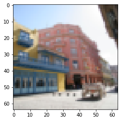
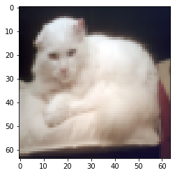
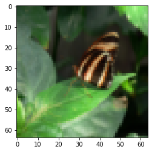
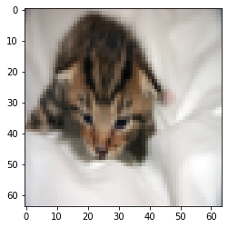
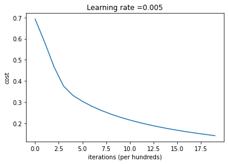
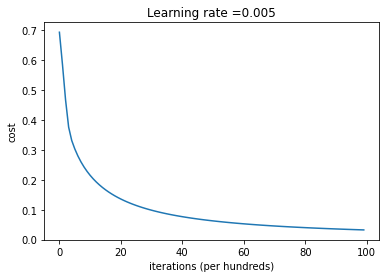
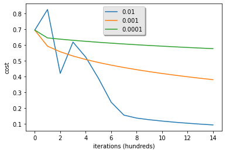
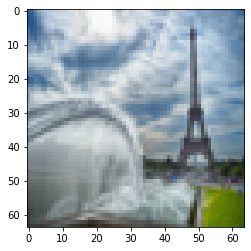

# Logistic Regression with a Neural Network mindset

Welcome to your first (required) programming assignment! You will build a logistic regression classifier to recognize  cats. This assignment will step you through how to do this with a Neural Network mindset, and will also hone your intuitions about deep learning.

**Instructions:**
- Do not use loops (for/while) in your code, unless the instructions explicitly ask you to do so.
- Use `np.dot(X,Y)` to calculate dot products.

**You will learn to:**
- Build the general architecture of a learning algorithm, including:
    - Initializing parameters
    - Calculating the cost function and its gradient
    - Using an optimization algorithm (gradient descent) 
- Gather all three functions above into a main model function, in the right order.

## Table of Contents
- [1 - Packages](#1)
- [2 - Overview of the Problem set](#2)
    - [Exercise 1](#ex-1)
    - [Exercise 2](#ex-2)
- [3 - General Architecture of the learning algorithm](#3)
- [4 - Building the parts of our algorithm](#4)
    - [4.1 - Helper functions](#4-1)
        - [Exercise 3 - sigmoid](#ex-3)
    - [4.2 - Initializing parameters](#4-2)
        - [Exercise 4 - initialize_with_zeros](#ex-4)
    - [4.3 - Forward and Backward propagation](#4-3)
        - [Exercise 5 - propagate](#ex-5)
    - [4.4 - Optimization](#4-4)
        - [Exercise 6 - optimize](#ex-6)
        - [Exercise 7 - predict](#ex-7)
- [5 - Merge all functions into a model](#5)
    - [Exercise 8 - model](#ex-8)
- [6 - Further analysis (optional/ungraded exercise)](#6)
- [7 - Test with your own image (optional/ungraded exercise)](#7)

<a name='1'></a>
## 1 - Packages ##

First, let's run the cell below to import all the packages that you will need during this assignment. 
- [numpy](https://numpy.org/doc/1.20/) is the fundamental package for scientific computing with Python.
- [h5py](http://www.h5py.org) is a common package to interact with a dataset that is stored on an H5 file.
- [matplotlib](http://matplotlib.org) is a famous library to plot graphs in Python.
- [PIL](https://pillow.readthedocs.io/en/stable/) and [scipy](https://www.scipy.org/) are used here to test your model with your own picture at the end.


```python
import numpy as np
import copy
import matplotlib.pyplot as plt
import h5py
import scipy
from PIL import Image
from scipy import ndimage
from lr_utils import load_dataset
from public_tests import *

%matplotlib inline
%load_ext autoreload
%autoreload 2
```

<a name='2'></a>
## 2 - Overview of the Problem set ##

**Problem Statement**: You are given a dataset ("data.h5") containing:
    - a training set of m_train images labeled as cat (y=1) or non-cat (y=0)
    - a test set of m_test images labeled as cat or non-cat
    - each image is of shape (num_px, num_px, 3) where 3 is for the 3 channels (RGB). Thus, each image is square (height = num_px) and (width = num_px).

You will build a simple image-recognition algorithm that can correctly classify pictures as cat or non-cat.

Let's get more familiar with the dataset. Load the data by running the following code.


```python
# Loading the data (cat/non-cat)
train_set_x_orig, train_set_y, test_set_x_orig, test_set_y, classes = load_dataset()
```

We added "_orig" at the end of image datasets (train and test) because we are going to preprocess them. After preprocessing, we will end up with train_set_x and test_set_x (the labels train_set_y and test_set_y don't need any preprocessing).

Each line of your train_set_x_orig and test_set_x_orig is an array representing an image. You can visualize an example by running the following code. Feel free also to change the `index` value and re-run to see other images. 


```python
# Example of a picture
index = 23
plt.imshow(train_set_x_orig[index])
print ("y = " + str(train_set_y[:, index]) + ", it's a '" + classes[np.squeeze(train_set_y[:, index])].decode("utf-8") +  "' picture.")
```

    y = [0], it's a 'non-cat' picture.





```python
# Example of a picture
index = 13
plt.imshow(train_set_x_orig[index])
print ("y = " + str(train_set_y[:, index]) + ", it's a '" + classes[np.squeeze(train_set_y[:, index])].decode("utf-8") +  "' picture.")
```

    y = [1], it's a 'cat' picture.





Many software bugs in deep learning come from having matrix/vector dimensions that don't fit. If you can keep your matrix/vector dimensions straight you will go a long way toward eliminating many bugs. 

<a name='ex-1'></a>
### Exercise 1
Find the values for:
    - m_train (number of training examples)
    - m_test (number of test examples)
    - num_px (= height = width of a training image)
Remember that `train_set_x_orig` is a numpy-array of shape (m_train, num_px, num_px, 3). For instance, you can access `m_train` by writing `train_set_x_orig.shape[0]`.


```python
test_set_x_orig.shape
```


    (50, 64, 64, 3)


```python
train_set_x_orig.shape
```


    (209, 64, 64, 3)


```python
#(≈ 3 lines of code)
# m_train = train_set_x_orig
# m_test = 
# num_px = 
# YOUR CODE STARTS HERE
m_train = train_set_x_orig
m_test = test_set_x_orig
num_px = 64

# YOUR CODE ENDS HERE

print ("Number of training examples: m_train = " + str(m_train))
print ("Number of testing examples: m_test = " + str(m_test))
print ("Height/Width of each image: num_px = " + str(num_px))
print ("Each image is of size: (" + str(num_px) + ", " + str(num_px) + ", 3)")
print ("train_set_x shape: " + str(train_set_x_orig.shape))
print ("train_set_y shape: " + str(train_set_y.shape))
print ("test_set_x shape: " + str(test_set_x_orig.shape))
print ("test_set_y shape: " + str(test_set_y.shape))
```

    Number of training examples: m_train = [[[[ 17  31  56]
       [ 22  33  59]
       [ 25  35  62]
       ...
       [  1  28  57]
       [  1  26  56]
       [  1  22  51]]
    
      [[ 25  36  62]
       [ 28  38  64]
       [ 30  40  67]
       ...
       [  1  27  56]
       [  1  25  55]
       [  2  21  51]]
    
      [[ 32  40  67]
       [ 34  42  69]
       [ 35  42  70]
       ...
       [  1  25  55]
       [  0  24  54]
       [  1  21  51]]
    
      ...
    
      [[  0   0   0]
       [  0   0   0]
       [  0   0   0]
       ...
       [  0   0   0]
       [  0   0   0]
       [  0   0   0]]
    
      [[  0   0   0]
       [  0   0   0]
       [  0   0   0]
       ...
       [  0   0   0]
       [  0   0   0]
       [  0   0   0]]
    
      [[  0   0   0]
       [  0   0   0]
       [  0   0   0]
       ...
       [  0   0   0]
       [  0   0   0]
       [  0   0   0]]]
    
    
     [[[196 192 190]
       [193 186 182]
       [188 179 174]
       ...
       [ 90 142 200]
       [ 90 142 201]
       [ 90 142 201]]
    
      [[230 229 229]
       [204 199 197]
       [193 186 181]
       ...
       [ 91 143 201]
       [ 91 143 201]
       [ 91 143 201]]
    
      [[232 225 224]
       [235 234 234]
       [208 205 202]
       ...
       [ 91 144 202]
       [ 91 144 202]
       [ 92 144 202]]
    
      ...
    
      [[ 18  17  15]
       [ 14  14  13]
       [ 29  29  32]
       ...
       [ 83  81  81]
       [ 84  82  83]
       [ 82  81  82]]
    
      [[ 22  20  18]
       [ 16  15  14]
       [ 25  24  24]
       ...
       [ 82  80  80]
       [ 83  81  82]
       [ 82  81  81]]
    
      [[ 45  43  39]
       [ 61  59  54]
       [ 81  78  74]
       ...
       [ 83  82  81]
       [ 84  82  82]
       [ 82  80  81]]]
    
    
     [[[ 82  71  68]
       [ 89  83  83]
       [100  98 104]
       ...
       [131 132 137]
       [126 124 124]
       [105  97  95]]
    
      [[ 95  91  97]
       [104 104 113]
       [110 115 126]
       ...
       [135 134 135]
       [127 122 119]
       [111 105 103]]
    
      [[ 94  85  83]
       [ 97  89  90]
       [110 109 115]
       ...
       [136 134 131]
       [127 120 117]
       [116 108 104]]
    
      ...
    
      [[ 96 116 131]
       [ 97 115 130]
       [103 123 139]
       ...
       [152 155 157]
       [146 149 152]
       [130 133 134]]
    
      [[ 90 108 123]
       [ 92 108 121]
       [100 119 134]
       ...
       [150 152 155]
       [144 146 147]
       [134 135 134]]
    
      [[ 86 102 116]
       [ 87 103 115]
       [ 94 114 127]
       ...
       [154 156 160]
       [146 148 152]
       [138 141 142]]]
    
    
     ...
    
    
     [[[143 155 165]
       [184 190 198]
       [142 149 155]
       ...
       [ 99  92 102]
       [120  98 102]
       [100  84  95]]
    
      [[151 149 139]
       [173 179 185]
       [105 135 141]
       ...
       [ 91  87  99]
       [119  99 104]
       [120  95 101]]
    
      [[204 190 185]
       [180 185 195]
       [117 155 177]
       ...
       [ 96  88 101]
       [125 103 110]
       [120 100 110]]
    
      ...
    
      [[ 41  80 116]
       [ 41  80 116]
       [ 41  78 115]
       ...
       [ 63  75  98]
       [ 60  72  98]
       [ 60  70  96]]
    
      [[ 71  90 121]
       [ 73  91 123]
       [ 74  91 124]
       ...
       [ 79 101 142]
       [ 80 100 140]
       [ 82 101 139]]
    
      [[ 71  88 122]
       [ 73  92 128]
       [ 76  95 131]
       ...
       [ 81 106 150]
       [ 85 108 151]
       [ 85 107 149]]]
    
    
     [[[ 22  24  23]
       [ 23  25  24]
       [ 24  26  25]
       ...
       [ 24  29  25]
       [ 23  25  22]
       [ 20  22  21]]
    
      [[ 22  24  23]
       [ 23  25  24]
       [ 23  26  25]
       ...
       [ 22  28  23]
       [ 20  23  22]
       [ 19  21  21]]
    
      [[ 22  24  22]
       [ 23  25  24]
       [ 23  26  25]
       ...
       [ 23  27  23]
       [ 20  23  21]
       [ 18  20  19]]
    
      ...
    
      [[  8   5   0]
       [  9   6   1]
       [  9   6   1]
       ...
       [  4   5   0]
       [  5   4   0]
       [  4   5   0]]
    
      [[  7   5   0]
       [  8   5   1]
       [  9   6   1]
       ...
       [  4   5   0]
       [  4   5   0]
       [  4   5   0]]
    
      [[  7   5   0]
       [  8   5   0]
       [  9   6   1]
       ...
       [  4   5   0]
       [  4   5   0]
       [  4   5   0]]]
    
    
     [[[  8  28  53]
       [ 14  33  58]
       [ 19  35  61]
       ...
       [ 11  16  35]
       [ 10  16  35]
       [  9  14  32]]
    
      [[ 15  31  57]
       [ 15  32  58]
       [ 18  34  60]
       ...
       [ 13  17  35]
       [ 13  17  35]
       [ 13  16  35]]
    
      [[ 20  35  61]
       [ 19  33  59]
       [ 20  33  59]
       ...
       [ 16  17  35]
       [ 16  18  35]
       [ 15  17  35]]
    
      ...
    
      [[  0   0   0]
       [  0   0   0]
       [  0   0   0]
       ...
       [  0   0   0]
       [  0   0   0]
       [  0   0   0]]
    
      [[  0   0   0]
       [  0   0   0]
       [  0   0   0]
       ...
       [  0   0   0]
       [  0   0   0]
       [  0   0   0]]
    
      [[  0   0   0]
       [  0   0   0]
       [  0   0   0]
       ...
       [  0   0   0]
       [  0   0   0]
       [  0   0   0]]]]
    Number of testing examples: m_test = [[[[158 104  83]
       [161 106  85]
       [162 107  84]
       ...
       [170 120 100]
       [167 121 103]
       [172 127 109]]
    
      [[158 103  82]
       [160 104  82]
       [162 105  83]
       ...
       [169 118  99]
       [164 117  98]
       [168 121 104]]
    
      [[158 104  82]
       [161 105  82]
       [162 105  83]
       ...
       [173 123 102]
       [169 122 104]
       [168 122 104]]
    
      ...
    
      [[102  68  52]
       [ 44  31  23]
       [ 28  23  20]
       ...
       [163 118 102]
       [163 120 103]
       [166 121 105]]
    
      [[ 99  67  51]
       [ 38  28  22]
       [ 30  26  23]
       ...
       [161 117 100]
       [164 121 104]
       [168 123 106]]
    
      [[127  95  72]
       [ 39  29  22]
       [ 30  25  22]
       ...
       [165 122 105]
       [169 126 109]
       [173 128 110]]]
    
    
     [[[115 110 111]
       [137 129 129]
       [155 146 145]
       ...
       [159 156 157]
       [141 141 145]
       [121 122 127]]
    
      [[123 118 120]
       [143 136 136]
       [159 153 150]
       ...
       [167 164 165]
       [151 151 154]
       [130 133 137]]
    
      [[135 130 130]
       [150 145 141]
       [164 159 153]
       ...
       [173 174 172]
       [160 162 162]
       [141 144 148]]
    
      ...
    
      [[197 196 205]
       [208 209 214]
       [215 216 220]
       ...
       [222 224 229]
       [205 208 215]
       [185 189 197]]
    
      [[190 192 199]
       [203 205 210]
       [213 214 218]
       ...
       [217 220 225]
       [198 202 209]
       [178 182 191]]
    
      [[183 186 193]
       [197 199 205]
       [208 210 214]
       ...
       [212 215 220]
       [192 196 203]
       [171 176 186]]]
    
    
     [[[255 253 254]
       [255 253 254]
       [255 253 254]
       ...
       [197 178 118]
       [195 177 116]
       [192 176 115]]
    
      [[255 253 254]
       [255 253 254]
       [255 253 254]
       ...
       [197 178 120]
       [195 176 118]
       [193 174 118]]
    
      [[255 253 254]
       [255 253 254]
       [255 253 254]
       ...
       [197 177 121]
       [194 174 121]
       [190 171 122]]
    
      ...
    
      [[ 94  95  97]
       [102 104 108]
       [115 113 115]
       ...
       [ 68  67  91]
       [ 71  55  80]
       [ 64  51  82]]
    
      [[ 68  71  69]
       [ 75  79  80]
       [ 82  91  91]
       ...
       [122 103 109]
       [114  84  99]
       [ 97  72 100]]
    
      [[ 67  86  89]
       [ 62  83  90]
       [ 47  73  82]
       ...
       [147 120 125]
       [142 110 118]
       [133 101 121]]]
    
    
     ...
    
    
     [[[ 41  47  84]
       [ 72  78 112]
       [103 102 124]
       ...
       [125 112 119]
       [107 101 117]
       [ 76  79 109]]
    
      [[ 93  96 119]
       [112 109 124]
       [130 122 136]
       ...
       [141 121 118]
       [130 112 114]
       [122 109 117]]
    
      [[119 114 123]
       [133 124 128]
       [164 149 145]
       ...
       [187 160 135]
       [157 132 120]
       [136 115 109]]
    
      ...
    
      [[233 223 207]
       [235 226 218]
       [242 236 235]
       ...
       [164 170 196]
       [189 185 196]
       [190 182 188]]
    
      [[247 250 248]
       [236 238 232]
       [219 215 219]
       ...
       [118 101 117]
       [153 134 154]
       [174 146 156]]
    
      [[253 254 254]
       [246 250 249]
       [226 233 234]
       ...
       [154 111  93]
       [176 132 104]
       [183 141 116]]]
    
    
     [[[ 18  18  16]
       [ 35  36  31]
       [ 54  57  52]
       ...
       [138 140 118]
       [139 141 124]
       [130 129 114]]
    
      [[ 21  21  18]
       [ 44  45  39]
       [ 68  74  66]
       ...
       [128 131 109]
       [116 117  98]
       [ 95  93  76]]
    
      [[ 30  31  26]
       [ 54  58  52]
       [ 99 110 104]
       ...
       [127 129 108]
       [113 114  94]
       [ 99  99  82]]
    
      ...
    
      [[178 178 163]
       [161 163 146]
       [170 174 163]
       ...
       [112 108  85]
       [149 150 131]
       [180 185 172]]
    
      [[182 183 167]
       [172 175 162]
       [170 173 162]
       ...
       [ 88  90  77]
       [122 115  89]
       [157 154 131]]
    
      [[188 190 179]
       [173 175 163]
       [160 162 146]
       ...
       [ 48  50  44]
       [103 103  89]
       [144 137 108]]]
    
    
     [[[133 163  75]
       [ 98 120  44]
       [108 132  47]
       ...
       [ 96 138  97]
       [ 96 146 109]
       [ 81 132 101]]
    
      [[ 79 102  39]
       [ 83 112  33]
       [ 76 106  26]
       ...
       [ 99 149  76]
       [ 71 119  62]
       [ 58 106  72]]
    
      [[ 35  53  27]
       [ 54  74  46]
       [ 35  55  17]
       ...
       [110 157 122]
       [ 72 119  89]
       [ 81 131 108]]
    
      ...
    
      [[ 76 108  79]
       [ 70 110  83]
       [ 70 105  84]
       ...
       [ 25  49  21]
       [ 26  53  24]
       [ 27  54  28]]
    
      [[109 120  97]
       [ 86 116  86]
       [ 71 105  79]
       ...
       [ 17  46  20]
       [ 23  49  28]
       [ 19  33  18]]
    
      [[ 97 117 100]
       [ 70 108  75]
       [ 75  99  69]
       ...
       [  8  33  12]
       [ 13  35  18]
       [  5  22   5]]]]
    Height/Width of each image: num_px = 64
    Each image is of size: (64, 64, 3)
    train_set_x shape: (209, 64, 64, 3)
    train_set_y shape: (1, 209)
    test_set_x shape: (50, 64, 64, 3)
    test_set_y shape: (1, 50)


**Expected Output for m_train, m_test and num_px**: 
<table style="width:15%">
  <tr>
    <td> m_train </td>
    <td> 209 </td> 
  </tr>
  
  <tr>
    <td>m_test</td>
    <td> 50 </td> 
  </tr>
  
  <tr>
    <td>num_px</td>
    <td> 64 </td> 
  </tr>
  
</table>


For convenience, you should now reshape images of shape (num_px, num_px, 3) in a numpy-array of shape (num_px $*$ num_px $*$ 3, 1). After this, our training (and test) dataset is a numpy-array where each column represents a flattened image. There should be m_train (respectively m_test) columns.

<a name='ex-2'></a>
### Exercise 2
Reshape the training and test data sets so that images of size (num_px, num_px, 3) are flattened into single vectors of shape (num\_px $*$ num\_px $*$ 3, 1).

A trick when you want to flatten a matrix X of shape (a,b,c,d) to a matrix X_flatten of shape (b$*$c$*$d, a) is to use: 
```python
X_flatten = X.reshape(X.shape[0], -1).T      # X.T is the transpose of X
```


```python
# Reshape the training and test examples
#(≈ 2 lines of code)
# train_set_x_flatten = ...
# test_set_x_flatten = ...
# YOUR CODE STARTS HERE


# YOUR CODE ENDS HERE
train_set_x_flatten = m_train.reshape(m_train.shape[0], -1).T # flatten
test_set_x_flatten = m_test.reshape(m_test.shape[0], -1).T

# Check that the first 10 pixels of the second image are in the correct place
assert np.alltrue(train_set_x_flatten[0:10, 1] == [196, 192, 190, 193, 186, 182, 188, 179, 174, 213]), "Wrong solution. Use (X.shape[0], -1).T."
assert np.alltrue(test_set_x_flatten[0:10, 1] == [115, 110, 111, 137, 129, 129, 155, 146, 145, 159]), "Wrong solution. Use (X.shape[0], -1).T."

print ("train_set_x_flatten shape: " + str(train_set_x_flatten.shape))
print ("train_set_y shape: " + str(train_set_y.shape))
print ("test_set_x_flatten shape: " + str(test_set_x_flatten.shape))
print ("test_set_y shape: " + str(test_set_y.shape))
```

    train_set_x_flatten shape: (12288, 209)
    train_set_y shape: (1, 209)
    test_set_x_flatten shape: (12288, 50)
    test_set_y shape: (1, 50)


**Expected Output**: 

<table style="width:35%">
  <tr>
    <td>train_set_x_flatten shape</td>
    <td> (12288, 209)</td> 
  </tr>
  <tr>
    <td>train_set_y shape</td>
    <td>(1, 209)</td> 
  </tr>
  <tr>
    <td>test_set_x_flatten shape</td>
    <td>(12288, 50)</td> 
  </tr>
  <tr>
    <td>test_set_y shape</td>
    <td>(1, 50)</td> 
  </tr>
</table>

To represent color images, the red, green and blue channels (RGB) must be specified for each pixel, and so the pixel value is actually a vector of three numbers ranging from 0 to 255.

One common preprocessing step in machine learning is to center and standardize your dataset, meaning that you substract the mean of the whole numpy array from each example, and then divide each example by the standard deviation of the whole numpy array. But for picture datasets, it is simpler and more convenient and works almost as well to just divide every row of the dataset by 255 (the maximum value of a pixel channel).

전처리에서 중요한 작업중 하나는 dataset을 중앙 정렬하여 보편화시키는 것
이는 전체 평균을 각각의 데이터에 뺄셈하는 과정이거나, 전체 표준편차로 각각의 데이터에 나눗셈하는 과정이다.
하지만 사진 속 dataset은 단순하기 때문에 255(rgb) 값으로 나눗셈할 것이다

<!-- During the training of your model, you're going to multiply weights and add biases to some initial inputs in order to observe neuron activations. Then you backpropogate with the gradients to train the model. But, it is extremely important for each feature to have a similar range such that our gradients don't explode. You will see that more in detail later in the lectures. !--> 

Let's standardize our dataset.


```python
train_set_x = train_set_x_flatten / 255.
test_set_x = test_set_x_flatten / 255.
```

<font color='blue'>
    
    
**What you need to remember:**

Common steps for pre-processing a new dataset are:
- Figure out the dimensions and shapes of the problem (m_train, m_test, num_px, ...)
- Reshape the datasets such that each example is now a vector of size (num_px \* num_px \* 3, 1)
- "Standardize" the data

<a name='3'></a>
## 3 - General Architecture of the learning algorithm ##

It's time to design a simple algorithm to distinguish cat images from non-cat images.

You will build a Logistic Regression, using a Neural Network mindset. The following Figure explains why **Logistic Regression is actually a very simple Neural Network!**


**Mathematical expression of the algorithm**:

For one example $x^{(i)}$:
$$z^{(i)} = w^T x^{(i)} + b \tag{1}$$
$$\hat{y}^{(i)} = a^{(i)} = sigmoid(z^{(i)})\tag{2}$$ 
$$ \mathcal{L}(a^{(i)}, y^{(i)}) =  - y^{(i)}  \log(a^{(i)}) - (1-y^{(i)} )  \log(1-a^{(i)})\tag{3}$$

The cost is then computed by summing over all training examples:
$$ J = \frac{1}{m} \sum_{i=1}^m \mathcal{L}(a^{(i)}, y^{(i)})\tag{6}$$

**Key steps**:
In this exercise, you will carry out the following steps: 
    - Initialize the parameters of the model
    - Learn the parameters for the model by minimizing the cost  
    - Use the learned parameters to make predictions (on the test set)
    - Analyse the results and conclude

<a name='4'></a>
## 4 - Building the parts of our algorithm ## 

The main steps for building a Neural Network are:
1. Define the model structure (such as number of input features) 
2. Initialize the model's parameters
3. Loop:
    - Calculate current loss (forward propagation)
    - Calculate current gradient (backward propagation)
    - Update parameters (gradient descent)

You often build 1-3 separately and integrate them into one function we call `model()`.

<a name='4-1'></a>
### 4.1 - Helper functions

<a name='ex-3'></a>
### Exercise 3 - sigmoid
Using your code from "Python Basics", implement `sigmoid()`. As you've seen in the figure above, you need to compute $sigmoid(z) = \frac{1}{1 + e^{-z}}$ for $z = w^T x + b$ to make predictions. Use np.exp().


```python
# GRADED FUNCTION: sigmoid

def sigmoid(z):
    """
    Compute the sigmoid of z

    Arguments:
    z -- A scalar or numpy array of any size.

    Return:
    s -- sigmoid(z)
    """

    #(≈ 1 line of code)
    # s = ...
    # YOUR CODE STARTS HERE
    
    s = 1 /(1+np.exp(-z))
    # YOUR CODE ENDS HERE
    
    return s
```


```python
print ("sigmoid([0, 2]) = " + str(sigmoid(np.array([0,2]))))

sigmoid_test(sigmoid)
```

    sigmoid([0, 2]) = [0.5        0.88079708]
    All tests passed!


```python
x = np.array([0.5, 0, 2.0])
output = sigmoid(x)
print(output)
```

    [0.62245933 0.5        0.88079708]


<a name='4-2'></a>
### 4.2 - Initializing parameters

<a name='ex-4'></a>
### Exercise 4 - initialize_with_zeros
Implement parameter initialization in the cell below. You have to initialize w as a vector of zeros. If you don't know what numpy function to use, look up np.zeros() in the Numpy library's documentation.


```python
# GRADED FUNCTION: initialize_with_zeros

def initialize_with_zeros(dim):
    """
    This function creates a vector of zeros of shape (dim, 1) for w and initializes b to 0.
    
    Argument:
    dim -- size of the w vector we want (or number of parameters in this case)
    
    Returns:
    w -- initialized vector of shape (dim, 1)
    b -- initialized scalar (corresponds to the bias) of type float
    """
    
    # (≈ 2 lines of code)
    # w = ...
    # b = ...
    # YOUR CODE STARTS HERE
    w = np.zeros((dim,1))
    b = 0.0
    # YOUR CODE ENDS HERE

    return w, b
```


```python
dim = 2
w, b = initialize_with_zeros(dim)

assert type(b) == float
print ("w = " + str(w))
print ("b = " + str(b))

initialize_with_zeros_test(initialize_with_zeros)
```

    w = [[0.]
     [0.]]
    b = 0.0
    All tests passed!


<a name='4-3'></a>
### 4.3 - Forward and Backward propagation

Now that your parameters are initialized, you can do the "forward" and "backward" propagation steps for learning the parameters.

<a name='ex-5'></a>
### Exercise 5 - propagate
Implement a function `propagate()` that computes the cost function and its gradient.

**Hints**:

Forward Propagation:
- You get X
- You compute $A = \sigma(w^T X + b) = (a^{(1)}, a^{(2)}, ..., a^{(m-1)}, a^{(m)})$
- You calculate the cost function: $J = -\frac{1}{m}\sum_{i=1}^{m}(y^{(i)}\log(a^{(i)})+(1-y^{(i)})\log(1-a^{(i)}))$

Here are the two formulas you will be using: 

$$ \frac{\partial J}{\partial w} = \frac{1}{m}X(A-Y)^T\tag{7}$$
$$ \frac{\partial J}{\partial b} = \frac{1}{m} \sum_{i=1}^m (a^{(i)}-y^{(i)})\tag{8}$$


```python
# GRADED FUNCTION: propagate

def propagate(w, b, X, Y):
    """
    Implement the cost function and its gradient for the propagation explained above

    Arguments:
    w -- weights, a numpy array of size (num_px * num_px * 3, 1)
    b -- bias, a scalar
    X -- data of size (num_px * num_px * 3, number of examples)
    Y -- true "label" vector (containing 0 if non-cat, 1 if cat) of size (1, number of examples)

    Return:
    cost -- negative log-likelihood cost for logistic regression
    dw -- gradient of the loss with respect to w, thus same shape as w
    db -- gradient of the loss with respect to b, thus same shape as b
    
    Tips:
    - Write your code step by step for the propagation. np.log(), np.dot()
    """
    
    m = X.shape[1]
    
    # FORWARD PROPAGATION (FROM X TO COST)
    #(≈ 2 lines of code)
    # compute activation
    # A = ...
    # compute cost using np.dot. Don't use loops for the sum.
    # cost = ...                                
    # YOUR CODE STARTS HERE
    
    A = sigmoid(np.dot(w.T,X)+b)
    cost = -(1/m)*np.sum( (Y*np.log(A)+(1-Y)*np.log(1-A) ))
    
    # YOUR CODE ENDS HERE

    # BACKWARD PROPAGATION (TO FIND GRAD)
    #(≈ 2 lines of code)
    # dw = ...
    # db = ...
    # YOUR CODE STARTS HERE
    
    dw = (1/m) * np.dot(X,(A-Y).T)
    db = (1/m) * np.sum(A-Y)
    # YOUR CODE ENDS HERE
    cost = np.squeeze(np.array(cost))
   
    
    grads = {"dw": dw,
             "db": db}
    
    return grads, cost
```


```python
w =  np.array([[1.], [2]])
b = 1.5
X = np.array([[1., -2., -1.], [3., 0.5, -3.2]])
Y = np.array([[1, 1, 0]])
grads, cost = propagate(w, b, X, Y)

assert type(grads["dw"]) == np.ndarray
assert grads["dw"].shape == (2, 1)
assert type(grads["db"]) == np.float64


print ("dw = " + str(grads["dw"]))
print ("db = " + str(grads["db"]))
print ("cost = " + str(cost))

propagate_test(propagate)
```

    dw = [[ 0.25071532]
     [-0.06604096]]
    db = -0.1250040450043965
    cost = 0.15900537707692405
    All tests passed!


**Expected output**

```
dw = [[ 0.25071532]
 [-0.06604096]]
db = -0.1250040450043965
cost = 0.15900537707692405
```

<a name='4-4'></a>
### 4.4 - Optimization
- You have initialized your parameters.
- You are also able to compute a cost function and its gradient.
- Now, you want to update the parameters using gradient descent.

<a name='ex-6'></a>
### Exercise 6 - optimize
Write down the optimization function. The goal is to learn $w$ and $b$ by minimizing the cost function $J$. For a parameter $\theta$, the update rule is $ \theta = \theta - \alpha \text{ } d\theta$, where $\alpha$ is the learning rate.


```python
# GRADED FUNCTION: optimize

def optimize(w, b, X, Y, num_iterations=100, learning_rate=0.009, print_cost=False):
    """
    This function optimizes w and b by running a gradient descent algorithm
    
    Arguments:
    w -- weights, a numpy array of size (num_px * num_px * 3, 1)
    b -- bias, a scalar
    X -- data of shape (num_px * num_px * 3, number of examples)
    Y -- true "label" vector (containing 0 if non-cat, 1 if cat), of shape (1, number of examples)
    num_iterations -- number of iterations of the optimization loop
    learning_rate -- learning rate of the gradient descent update rule
    print_cost -- True to print the loss every 100 steps
    
    Returns:
    params -- dictionary containing the weights w and bias b
    grads -- dictionary containing the gradients of the weights and bias with respect to the cost function
    costs -- list of all the costs computed during the optimization, this will be used to plot the learning curve.
    
    Tips:
    You basically need to write down two steps and iterate through them:
        1) Calculate the cost and the gradient for the current parameters. Use propagate().
        2) Update the parameters using gradient descent rule for w and b.
    """
    
    w = copy.deepcopy(w)
    b = copy.deepcopy(b)
    
    costs = []
    
    for i in range(num_iterations):
        # (≈ 1 lines of code)
        # Cost and gradient calculation 
        # grads, cost = ...
        # YOUR CODE STARTS HERE
        grads, cost = propagate(w, b, X, Y)
        
        # YOUR CODE ENDS HERE
        
        # Retrieve derivatives from grads
        dw = grads["dw"]
        db = grads["db"]
        
        # update rule (≈ 2 lines of code)
        # w = ...
        # b = ...
        # YOUR CODE STARTS HERE
        w = w - learning_rate * dw
        b = b - learning_rate * db
        
        # YOUR CODE ENDS HERE
        
        # Record the costs
        if i % 100 == 0:
            costs.append(cost)
        
            # Print the cost every 100 training iterations
            if print_cost:
                print ("Cost after iteration %i: %f" %(i, cost))
    
    params = {"w": w,
              "b": b}
    
    grads = {"dw": dw,
             "db": db}
    
    return params, grads, costs
```


```python
params, grads, costs = optimize(w, b, X, Y, num_iterations=100, learning_rate=0.009, print_cost=False)

print ("w = " + str(params["w"]))
print ("b = " + str(params["b"]))
print ("dw = " + str(grads["dw"]))
print ("db = " + str(grads["db"]))
print("Costs = " + str(costs))

optimize_test(optimize)
```

    w = [[0.80956046]
     [2.0508202 ]]
    b = 1.5948713189708588
    dw = [[ 0.17860505]
     [-0.04840656]]
    db = -0.08888460336847771
    Costs = [array(0.15900538)]
    All tests passed!


<a name='ex-7'></a>
### Exercise 7 - predict
The previous function will output the learned w and b. We are able to use w and b to predict the labels for a dataset X. Implement the `predict()` function. There are two steps to computing predictions:

1. Calculate $\hat{Y} = A = \sigma(w^T X + b)$

2. Convert the entries of a into 0 (if activation <= 0.5) or 1 (if activation > 0.5), stores the predictions in a vector `Y_prediction`. If you wish, you can use an `if`/`else` statement in a `for` loop (though there is also a way to vectorize this). 


```python
# GRADED FUNCTION: predict

def predict(w, b, X):
    '''
    Predict whether the label is 0 or 1 using learned logistic regression parameters (w, b)
    
    Arguments:
    w -- weights, a numpy array of size (num_px * num_px * 3, 1)
    b -- bias, a scalar
    X -- data of size (num_px * num_px * 3, number of examples)
    
    Returns:
    Y_prediction -- a numpy array (vector) containing all predictions (0/1) for the examples in X
    '''
    
    m = X.shape[1]
    Y_prediction = np.zeros((1, m))
    w = w.reshape(X.shape[0], 1)
    
    # Compute vector "A" predicting the probabilities of a cat being present in the picture
    #(≈ 1 line of code)
    # A = ...
    # YOUR CODE STARTS HERE
    A = sigmoid(np.dot(w.T,X)+b)
    
    # YOUR CODE ENDS HERE
    
    for i in range(A.shape[1]):
        
        # Convert probabilities A[0,i] to actual predictions p[0,i]
        #(≈ 4 lines of code)
        # if A[0, i] > ____ :
        #     Y_prediction[0,i] = 
        # else:
        #     Y_prediction[0,i] = 
        # YOUR CODE STARTS HERE
        if A[0,i] > 0.5:
            Y_prediction[0,i] = 1
        else:
            Y_prediction[0,i] = 0       
        
        # YOUR CODE ENDS HERE
    
    return Y_prediction
```


```python
w = np.array([[0.1124579], [0.23106775]])
b = -0.3
X = np.array([[1., -1.1, -3.2],[1.2, 2., 0.1]])
print ("predictions = " + str(predict(w, b, X)))

predict_test(predict)
```

    predictions = [[1. 1. 0.]]
    All tests passed!


<font color='blue'>
    
**What to remember:**
    
You've implemented several functions that:
- Initialize (w,b)
- Optimize the loss iteratively to learn parameters (w,b):
    - Computing the cost and its gradient 
    - Updating the parameters using gradient descent
- Use the learned (w,b) to predict the labels for a given set of examples

<a name='5'></a>
## 5 - Merge all functions into a model ##

You will now see how the overall model is structured by putting together all the building blocks (functions implemented in the previous parts) together, in the right order.

<a name='ex-8'></a>
### Exercise 8 - model
Implement the model function. Use the following notation:
    - Y_prediction_test for your predictions on the test set
    - Y_prediction_train for your predictions on the train set
    - parameters, grads, costs for the outputs of optimize()


```python
# GRADED FUNCTION: model

def model(X_train, Y_train, X_test, Y_test, num_iterations=2000, learning_rate=0.5, print_cost=False):
    """
    Builds the logistic regression model by calling the function you've implemented previously
    
    Arguments:
    X_train -- training set represented by a numpy array of shape (num_px * num_px * 3, m_train)
    Y_train -- training labels represented by a numpy array (vector) of shape (1, m_train)
    X_test -- test set represented by a numpy array of shape (num_px * num_px * 3, m_test)
    Y_test -- test labels represented by a numpy array (vector) of shape (1, m_test)
    num_iterations -- hyperparameter representing the number of iterations to optimize the parameters
    learning_rate -- hyperparameter representing the learning rate used in the update rule of optimize()
    print_cost -- Set to True to print the cost every 100 iterations
    
    Returns:
    d -- dictionary containing information about the model.
    """
    # (≈ 1 line of code)   
    # initialize parameters with zeros 
    # w, b = ...
    
    #(≈ 1 line of code)
    # Gradient descent 
    # params, grads, costs = ...
    
    # Retrieve parameters w and b from dictionary "params"
    # w = ...
    # b = ...
    
    # Predict test/train set examples (≈ 2 lines of code)
    # Y_prediction_test = ...
    # Y_prediction_train = ...
    
    # YOUR CODE STARTS HERE
    dim = X_train.shape[0]
    w, b = initialize_with_zeros(dim)
    params, grads, costs = optimize(w, b, X_train, Y_train, num_iterations, learning_rate, print_cost)
    w = params["w"]
    b = params["b"]
    Y_prediction_test = predict(w, b, X_test)
    Y_prediction_train = predict(w, b, X_train)
    # YOUR CODE ENDS HERE

    # Print train/test Errors
    if print_cost:
        print("train accuracy: {} %".format(100 - np.mean(np.abs(Y_prediction_train - Y_train)) * 100))
        print("test accuracy: {} %".format(100 - np.mean(np.abs(Y_prediction_test - Y_test)) * 100))

    
    d = {"costs": costs,
         "Y_prediction_test": Y_prediction_test, 
         "Y_prediction_train" : Y_prediction_train, 
         "w" : w, 
         "b" : b,
         "learning_rate" : learning_rate,
         "num_iterations": num_iterations}
    
    return d
```


```python
from public_tests import *

model_test(model)
```

    All tests passed!


If you pass all the tests, run the following cell to train your model.


```python
logistic_regression_model = model(train_set_x, train_set_y, test_set_x, test_set_y, num_iterations=2000, learning_rate=0.005, print_cost=True)
```

    Cost after iteration 0: 0.693147
    Cost after iteration 100: 0.584508
    Cost after iteration 200: 0.466949
    Cost after iteration 300: 0.376007
    Cost after iteration 400: 0.331463
    Cost after iteration 500: 0.303273
    Cost after iteration 600: 0.279880
    Cost after iteration 700: 0.260042
    Cost after iteration 800: 0.242941
    Cost after iteration 900: 0.228004
    Cost after iteration 1000: 0.214820
    Cost after iteration 1100: 0.203078
    Cost after iteration 1200: 0.192544
    Cost after iteration 1300: 0.183033
    Cost after iteration 1400: 0.174399
    Cost after iteration 1500: 0.166521
    Cost after iteration 1600: 0.159305
    Cost after iteration 1700: 0.152667
    Cost after iteration 1800: 0.146542
    Cost after iteration 1900: 0.140872
    train accuracy: 99.04306220095694 %
    test accuracy: 70.0 %


**Comment**: Training accuracy is close to 100%. This is a good sanity check: your model is working and has high enough capacity to fit the training data. Test accuracy is 70%. It is actually not bad for this simple model, given the small dataset we used and that logistic regression is a linear classifier. But no worries, you'll build an even better classifier next week!

Also, you see that the model is clearly overfitting the training data. Later in this specialization you will learn how to reduce overfitting, for example by using regularization. Using the code below (and changing the `index` variable) you can look at predictions on pictures of the test set.


```python
# Example of a picture that was wrongly classified.
index = 5
plt.imshow(test_set_x[:, index].reshape((num_px, num_px, 3)))
print ("y = " + str(test_set_y[0,index]) + ", you predicted that it is a \"" + classes[int(logistic_regression_model['Y_prediction_test'][0,index])].decode("utf-8") +  "\" picture.")
```

    y = 0, you predicted that it is a "cat" picture.





```python
# Example of a picture that was wrongly classified.
index = 1
plt.imshow(test_set_x[:, index].reshape((num_px, num_px, 3)))
print ("y = " + str(test_set_y[0,index]) + ", you predicted that it is a \"" + classes[int(logistic_regression_model['Y_prediction_test'][0,index])].decode("utf-8") +  "\" picture.")
```

    y = 1, you predicted that it is a "cat" picture.





Let's also plot the cost function and the gradients.


```python
# Plot learning curve (with costs)
costs = np.squeeze(logistic_regression_model['costs'])
plt.plot(costs)
plt.ylabel('cost')
plt.xlabel('iterations (per hundreds)')
plt.title("Learning rate =" + str(logistic_regression_model["learning_rate"]))
plt.show()
```





**Interpretation**:
You can see the cost decreasing. It shows that the parameters are being learned. However, you see that you could train the model even more on the training set. Try to increase the number of iterations in the cell above and rerun the cells. You might see that the training set accuracy goes up, but the test set accuracy goes down. This is called overfitting. 


```python
logistic_regression_model = model(train_set_x, train_set_y, test_set_x, test_set_y, num_iterations=10000, learning_rate=0.005, print_cost=True)


# Plot learning curve (with costs)
costs = np.squeeze(logistic_regression_model['costs'])
plt.plot(costs)
plt.ylabel('cost')
plt.xlabel('iterations (per hundreds)')
plt.title("Learning rate =" + str(logistic_regression_model["learning_rate"]))
plt.show()
```

    Cost after iteration 0: 0.693147
    Cost after iteration 100: 0.584508
    Cost after iteration 200: 0.466949
    Cost after iteration 300: 0.376007
    Cost after iteration 400: 0.331463
    Cost after iteration 500: 0.303273
    Cost after iteration 600: 0.279880
    Cost after iteration 700: 0.260042
    Cost after iteration 800: 0.242941
    Cost after iteration 900: 0.228004
    Cost after iteration 1000: 0.214820
    Cost after iteration 1100: 0.203078
    Cost after iteration 1200: 0.192544
    Cost after iteration 1300: 0.183033
    Cost after iteration 1400: 0.174399
    Cost after iteration 1500: 0.166521
    Cost after iteration 1600: 0.159305
    Cost after iteration 1700: 0.152667
    Cost after iteration 1800: 0.146542
    Cost after iteration 1900: 0.140872
    Cost after iteration 2000: 0.135608
    Cost after iteration 2100: 0.130708
    Cost after iteration 2200: 0.126137
    Cost after iteration 2300: 0.121861
    Cost after iteration 2400: 0.117855
    Cost after iteration 2500: 0.114093
    Cost after iteration 2600: 0.110554
    Cost after iteration 2700: 0.107219
    Cost after iteration 2800: 0.104072
    Cost after iteration 2900: 0.101097
    Cost after iteration 3000: 0.098280
    Cost after iteration 3100: 0.095610
    Cost after iteration 3200: 0.093075
    Cost after iteration 3300: 0.090667
    Cost after iteration 3400: 0.088374
    Cost after iteration 3500: 0.086190
    Cost after iteration 3600: 0.084108
    Cost after iteration 3700: 0.082119
    Cost after iteration 3800: 0.080219
    Cost after iteration 3900: 0.078402
    Cost after iteration 4000: 0.076662
    Cost after iteration 4100: 0.074994
    Cost after iteration 4200: 0.073395
    Cost after iteration 4300: 0.071860
    Cost after iteration 4400: 0.070385
    Cost after iteration 4500: 0.068968
    Cost after iteration 4600: 0.067604
    Cost after iteration 4700: 0.066291
    Cost after iteration 4800: 0.065027
    Cost after iteration 4900: 0.063807
    Cost after iteration 5000: 0.062631
    Cost after iteration 5100: 0.061496
    Cost after iteration 5200: 0.060400
    Cost after iteration 5300: 0.059341
    Cost after iteration 5400: 0.058317
    Cost after iteration 5500: 0.057327
    Cost after iteration 5600: 0.056368
    Cost after iteration 5700: 0.055440
    Cost after iteration 5800: 0.054541
    Cost after iteration 5900: 0.053669
    Cost after iteration 6000: 0.052824
    Cost after iteration 6100: 0.052005
    Cost after iteration 6200: 0.051209
    Cost after iteration 6300: 0.050436
    Cost after iteration 6400: 0.049686
    Cost after iteration 6500: 0.048957
    Cost after iteration 6600: 0.048248
    Cost after iteration 6700: 0.047559
    Cost after iteration 6800: 0.046888
    Cost after iteration 6900: 0.046236
    Cost after iteration 7000: 0.045601
    Cost after iteration 7100: 0.044982
    Cost after iteration 7200: 0.044380
    Cost after iteration 7300: 0.043793
    Cost after iteration 7400: 0.043220
    Cost after iteration 7500: 0.042662
    Cost after iteration 7600: 0.042118
    Cost after iteration 7700: 0.041587
    Cost after iteration 7800: 0.041069
    Cost after iteration 7900: 0.040563
    Cost after iteration 8000: 0.040069
    Cost after iteration 8100: 0.039587
    Cost after iteration 8200: 0.039116
    Cost after iteration 8300: 0.038655
    Cost after iteration 8400: 0.038205
    Cost after iteration 8500: 0.037765
    Cost after iteration 8600: 0.037335
    Cost after iteration 8700: 0.036914
    Cost after iteration 8800: 0.036502
    Cost after iteration 8900: 0.036099
    Cost after iteration 9000: 0.035704
    Cost after iteration 9100: 0.035318
    Cost after iteration 9200: 0.034940
    Cost after iteration 9300: 0.034570
    Cost after iteration 9400: 0.034207
    Cost after iteration 9500: 0.033851
    Cost after iteration 9600: 0.033503
    Cost after iteration 9700: 0.033161
    Cost after iteration 9800: 0.032826
    Cost after iteration 9900: 0.032498
    train accuracy: 100.0 %
    test accuracy: 70.0 %





<a name='6'></a>
## 6 - Further analysis (optional/ungraded exercise) ##

Congratulations on building your first image classification model. Let's analyze it further, and examine possible choices for the learning rate $\alpha$. 

#### Choice of learning rate ####

**Reminder**:
In order for Gradient Descent to work you must choose the learning rate wisely. The learning rate $\alpha$  determines how rapidly we update the parameters. If the learning rate is too large we may "overshoot" the optimal value. Similarly, if it is too small we will need too many iterations to converge to the best values. That's why it is crucial to use a well-tuned learning rate.

Let's compare the learning curve of our model with several choices of learning rates. Run the cell below. This should take about 1 minute. Feel free also to try different values than the three we have initialized the `learning_rates` variable to contain, and see what happens. 


```python
learning_rates = [0.01, 0.001, 0.0001]
models = {}

for lr in learning_rates:
    print ("Training a model with learning rate: " + str(lr))
    models[str(lr)] = model(train_set_x, train_set_y, test_set_x, test_set_y, num_iterations=1500, learning_rate=lr, print_cost=False)
    print ('\n' + "-------------------------------------------------------" + '\n')

for lr in learning_rates:
    plt.plot(np.squeeze(models[str(lr)]["costs"]), label=str(models[str(lr)]["learning_rate"]))

plt.ylabel('cost')
plt.xlabel('iterations (hundreds)')

legend = plt.legend(loc='upper center', shadow=True)
frame = legend.get_frame()
frame.set_facecolor('0.90')
plt.show()
```

    Training a model with learning rate: 0.01
    
    -------------------------------------------------------
    
    Training a model with learning rate: 0.001
    
    -------------------------------------------------------
    
    Training a model with learning rate: 0.0001
    
    -------------------------------------------------------
    





**Interpretation**: 
- Different learning rates give different costs and thus different predictions results.
- If the learning rate is too large (0.01), the cost may oscillate up and down. It may even diverge (though in this example, using 0.01 still eventually ends up at a good value for the cost). 
- A lower cost doesn't mean a better model. You have to check if there is possibly overfitting. It happens when the training accuracy is a lot higher than the test accuracy.
- In deep learning, we usually recommend that you: 
    - Choose the learning rate that better minimizes the cost function.
    - If your model overfits, use other techniques to reduce overfitting. (We'll talk about this in later videos.) 


<a name='7'></a>
## 7 - Test with your own image (optional/ungraded exercise) ##

Congratulations on finishing this assignment. You can use your own image and see the output of your model. To do that:
    1. Click on "File" in the upper bar of this notebook, then click "Open" to go on your Coursera Hub.
    2. Add your image to this Jupyter Notebook's directory, in the "images" folder
    3. Change your image's name in the following code
    4. Run the code and check if the algorithm is right (1 = cat, 0 = non-cat)!


```python
# change this to the name of your image file
my_image = "my_image.jpg"   

# We preprocess the image to fit your algorithm.
fname = "images/" + my_image
image = np.array(Image.open(fname).resize((num_px, num_px)))
plt.imshow(image)
image = image / 255.
image = image.reshape((1, num_px * num_px * 3)).T
my_predicted_image = predict(logistic_regression_model["w"], logistic_regression_model["b"], image)

print("y = " + str(np.squeeze(my_predicted_image)) + ", your algorithm predicts a \"" + classes[int(np.squeeze(my_predicted_image)),].decode("utf-8") +  "\" picture.")
```

    y = 0.0, your algorithm predicts a "non-cat" picture.





<font color='blue'>
    
**What to remember from this assignment:**
1. Preprocessing the dataset is important.
2. You implemented each function separately: initialize(), propagate(), optimize(). Then you built a model().
3. Tuning the learning rate (which is an example of a "hyperparameter") can make a big difference to the algorithm. You will see more examples of this later in this course!

Finally, if you'd like, we invite you to try different things on this Notebook. Make sure you submit before trying anything. Once you submit, things you can play with include:
    - Play with the learning rate and the number of iterations
    - Try different initialization methods and compare the results
    - Test other preprocessings (center the data, or divide each row by its standard deviation)

Bibliography:
- http://www.wildml.com/2015/09/implementing-a-neural-network-from-scratch/
- https://stats.stackexchange.com/questions/211436/why-do-we-normalize-images-by-subtracting-the-datasets-image-mean-and-not-the-c
